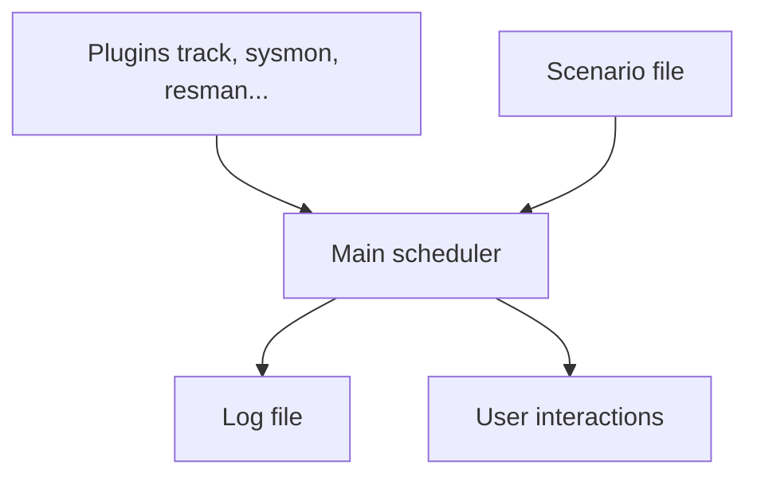

Behavior Research Methods (2020) 52:1980–1990
https://doi.org/10.3758/s13428-020-01364-w

# OpenMATB: A Multi-Attribute Task Battery promoting task customization, software extensibility and experiment replicability

J. Cegarra<sup>1</sup> • B. Valéry<sup>1</sup> • E. Avril<sup>1</sup> • C. Calmettes<sup>1</sup> • J. Navarro<sup>2,3</sup>

Published online: 5 March 2020
© The Psychonomic Society, Inc. 2020

## Abstract

OpenMATB is an open-source variant of the Multi-Attribute Task Battery (MATB) and is available under a free software license. MATB consists of a set of tasks representative of those performed in aircraft piloting. It is used, in particular, to study the effect of automation on decision-making, mental workload, and vigilance. Since the publication of MATB 20 years ago, the subject of automation has grown considerably in importance. After introducing the task battery, this article highlights three main requirements for an up-to-date implementation of MATB. First, there is a need for *task customization*, to make it possible to change the values, appearance or integrated components (such as rating scales) of the tasks. Second, researchers need *software extensibility* to enable them to integrate specific features, such as synchronization with psychophysiological devices. Third, to achieve *experiment replicability*, it is necessary that the source code and the scenario files are easily available and auditable. In the present paper, we explain how these aspects are implemented in OpenMATB by presenting the software architecture and features, while placing special emphasis on the crucial role of the plugin system and the simplicity of the format used in the script files. Finally, we present a number of general trends for the future study of automation in human factors research and ergonomics.

## Keywords

Task battery • Microworld • Aircraft piloting • Task customization • Software extensibility • Experiment replicability

## Introduction

First presented as a NASA Technical memorandum (Comstock & Arnegard, 1992), the Multi-Attribute Task Battery (MATB) contains a set of interactive tasks that are representative of those performed during aircraft piloting. It was designed at the NASA Ames Research Center as part of a more general software development project, following the *Workload/PerformANcE Simulation* (Window/PANES; King, Keifer, & Hart, 1989), a simulation of flying tasks, and the *Strategic Control of Response Efficiency* (SCORE; Hancock & Winge, 1988), a task battery for the analysis of strategic behaviors (see also Arnegard, 1991). MATB coherently reduces real-life piloting tasks to a format permitting the required level of experimental control. It requires participants to engage in four tasks presented simultaneously on a computer screen. These consist of (1) a monitoring task, (2) a tracking task, (3) an auditory communication task, and (4) a resource management task. The display screen also contains a (5) scheduling view displaying a chart of incoming task events (see Fig. 1).

MATB offers a robust way to study the effects of various parameters (e.g., automation, priorities, instructions, and so on) on the components of the participant's multitasking behavior, such as his/her decision-making, level of performance, ocular behavior, mental workload, and so on. Moreover, the realistic nature of the reduction allows researchers to design experiments that can be used even with participants having no prior experience of aircraft. This probably explains why, since it was first published, MATB has undoubtedly become one of the most firmly established microworlds used by human factors researchers. A Google Scholar search of international books, journals, and conference proceedings that excluded patents and citations revealed 681 references as of April 2018. Interestingly, the number of retrieved MATB references has grown since 1990, with 86 references in the 1990s, 231 in the 2000s, and more than 360 since 2010.

* J. Cegarra
  julien.cegarra@univ-jfc.fr

<sup>1</sup> Laboratoire Sciences de la Cognition, Technologie, Ergonomie (SCoTE EA 7420), Université de Toulouse, INU Champollion, Albi, France

<sup>2</sup> Laboratoire d'Etude des Mécanismes Cognitifs (LEMC EA 3082), Université Lyon 2, Lyon, France

<sup>3</sup> Institut Universitaire de France, Paris, France
---


Behav Res (2020) 52:1980–1990        1981

**Fig. 1** Screen capture of the default OpenMATB main screen

<table>
<thead>
<tr>
<th colspan="3">SYSTEM MONITORING</th>
<th>TRACKING</th>
<th>SCHEDULING</th>
</tr>
</thead>
<tbody>
<tr>
<td>F5</td>
<td>F6</td>
<td></td>
<td>T</td>
<td rowspan="3">(5)<br>Elapsed Time<br>0:00:21</td>
</tr>
<tr>
<td colspan="4">(1)</td>
</tr>
<tr>
<td>F1</td>
<td>F2</td>
<td>F3</td>
<td>F4</td>
</tr>
<tr>
<td colspan="2">COMMUNICATIONS</td>
<td colspan="2">RESOURCES</td>
<td>STATUS</td>
</tr>
<tr>
<td colspan="2">AUTO ON</td>
<td>A</td>
<td>B</td>
<td>1 • 0</td>
</tr>
<tr>
<td>Identifiant</td>
<td>LB13</td>
<td></td>
<td></td>
<td>2 • 800</td>
</tr>
<tr>
<td>NAV_1</td>
<td>130.6</td>
<td>A 2487 AUTO ON</td>
<td>2453</td>
<td>3 • 0</td>
</tr>
<tr>
<td>NAV_2</td>
<td>122.3</td>
<td>C</td>
<td>E</td>
<td>4 • 600</td>
</tr>
<tr>
<td>COM_1</td>
<td>110.3</td>
<td></td>
<td></td>
<td>5 • 600</td>
</tr>
<tr>
<td>COM_2</td>
<td>110.1</td>
<td></td>
<td></td>
<td>6 • 600</td>
</tr>
<tr>
<td colspan="2">(3)</td>
<td>1200 (4)</td>
<td>1200</td>
<td>7 • 0</td>
</tr>
<tr>
<td colspan="4"></td>
<td>8 • 0</td>
</tr>
</tbody>
</table>

Therefore, although it is now almost 30 years old, MATB still provides important support for scientific researchers. Importantly, Comstock and Arnegard (1992) included the source code for a software implementation of these tasks, clearly detailing each one of them. However, it was written in the now outdated Microsoft QuickBasic 4.5 language. Almost 20 years later, an updated version of the software was proposed by Santiago-Espada, Myer, Latorella, and Comstock (2011), and named the "revised Multi-Attribute Task Battery" (MATB-II). While MATB-II was designed for more modern operating systems, the source code was not made freely available and there was no easy way to extend it. This led other researchers to design MATB variants addressing specific needs, such as AF-MATB (Miller, 2010), or TSU-MATB (Thanoon, Zein-Sabatto, & McCurry, 2017). This is also the case with unpublished variants of MATB (e.g., Gazes et al., 2012). However, due to the multiplicity of the variants and the lack of the corresponding source codes, it has been difficult to document changes to the tasks and share additions to the software. As a result, the research community has become fragmented and this has impeded the replication of studies.

OpenMATB represents an open-source re-implementation of the Multi-Attribute Task Battery. Consolidating the available variants, it is also based on a modular approach allowing full customization and extensibility. The software source code is freely available under a free software license, which greatly facilitates experiment replication.

In this article, we first present the four tasks of the multi-attribute task battery before highlighting the three main contributions of OpenMATB: (1) task customization, (2) software extensibility, and (3) experiment replicability. We then present the software architecture and features. We conclude with some outlooks for the collaborative development of OpenMATB.

internationalization issues, and more general trends in the study of automation in human factors and ergonomics research.

Presentation of the Multi-Attribute Task Battery MATB requires participants to simultaneously perform four tasks that are distributed over the screen. A system monitoring task is displayed at the top left of the environment. A compensatory tracking task is at the top center. The interactive part of an auditory communication task is located at the bottom left. A resource management task is located at both the bottom center and the bottom right of the screen. Finally, the task battery also contains a scheduling view at the top right of the screen, displaying a chart of incoming events but not requiring any intervention from the participant (Fig. 1). So far, no formal justification for this screen layout has been proposed. However, Singh, Molloy, and Parasuraman (1997) have shown that moving an (automated) task into the operator's foveal field does not bring about a significant difference in performance, suggesting that these locations are only secondary parameters when compared with the nature of the proposed tasks. It is worth noting that the MATB environment is often used in a modular fashion, displaying only a subset of the tasks that are available. For instance, to study the effect of automation on performance, Parasuraman, Molloy, and Singh (1993) studies only displayed the monitoring, tracking, and resource management tasks. To understand the effect of multitasking, Molloy and Parasuraman (1996) also compared the MATB to a modified version displaying only the system monitoring task.

## The system monitoring task

In the system monitoring task, participants have to watch six visual indicators and correct any abnormal behavior. Under
---


1982                                                                                                      Behav Res (2020) 52:1980–1990

normal conditions, the two top buttons (or "lights") labeled "F5" and "F6" are respectively turned on (green) and off (gray). However, if "F5" turns off (gray color) or if "F6" turns on (red), the participants must press the appropriate response key (F5 and F6 respectively), in which case the button immediately returns to its default status. In most cases, these two buttons differ in their active color (i.e., green for the left button, red for the right button).

The bottom section of the task consists of four graduated scales labeled "F1", "F2", "F3", and "F4". Each scale contains a pointer that varies around the center. If the pointer moves outside of the central zone, either above or below, the participants must hit the corresponding response key (F1, F2, F3, and F4, respectively). When they do this, the task delivers two visual feedbacks. First, the pointer is set to the center of the scale and, secondly, a yellow rectangle appears at the very bottom of the corresponding scale. Both types of feedback are maintained for a predefined duration (e.g., 1.5 s in Comstock & Arnegard, 1992).

It is important to note that participants have only a limited amount of time (e.g., 15 s) to detect any abnormality before the situation returns to normal on its own, which would be considered as a human failure to respond to a task requirement.

In general, performance on the system monitoring task has been measured in terms of the percentage of successfully detected events, the mean response time for detection, as well as the number of false alarms made by the participant. It is also possible that the participant might have detected an event requiring intervention but hit an incorrect response key. Depending on the analysis, this can be considered either as an error (of correction) or a success (of detection). Because of this ambiguity and the low probability of such events, some authors usually exclude them from the analysis (e.g., Parasuraman et al., 1993).

## The tracking task

The tracking task is assumed to replicate continuous compensatory actions inherent in piloting an aircraft. Participants have to keep a cursor inside a rectangular target area, which is located at the center of a graduated scale. The cursor movements follow a forcing function corresponding to a sum of sinusoidal waves for the X and Y axes. As a result, the cursor path is comparable to a Lissajous curve, appearing random but actually being strictly identical across participants regardless of their actions. Whenever the cursor leaves the target area, it turns red.

This task can be handled either in a manual or an automatic mode. The corresponding label is displayed at the bottom right of the task. In manual mode ("MANUAL" label), participants have to use a joystick to keep the cursor in the target area. In automatic mode ("AUTO ON" label), the cursor movements are automatically compensated for by moving the cursor back toward the target area. In general, this task alternates between manual and automatic phases. These distinct phases can be displayed in the scheduling view (see below).

Performance on the tracking task is generally computed as the root mean squared (RMS) deviation of the cursor, from the center point, over various time points. For instance, in Molloy and Parasuraman (1996), the average RMS was calculated over periods of 1 s. However, depending on the instructions given, performance can also be considered as the proportion of time spent in the target area.

## The communication task

The communication task represents pilots' interactions with air traffic controllers (ATC), who might request changes in radio frequencies. Participants are presented with their own call sign (e.g., "GB54") and possess four radio channels ("COM 1", "COM 2", "COM 3", and "COM 4") tuned to particular frequencies. At various onsets, defined by the experimenter, an auditory instruction is provided in the following form: "{call sign} {call sign}, tune your {radio} radio to frequency {frequency}", for instance "G B five four, G B five four, tune your com one radio to frequency one three zero point five."

However, as is also the case in natural settings, not all auditory instructions are relevant, and each participant has to ignore any instructions that do not start with his/her own call sign. As a consequence, no response is required from the participant when the instruction starts with a distracting call sign (e.g., "FR32" instead of "GB54"). If the call sign is relevant, the participants must carry out the instructions as quickly and accurately as possible. To do so, they have to use the "up/down" arrow keys on the keyboard to select the correct radio channel, and the "left/right" keys to decrease/increase the frequency of the selected radio. The participants must then hit the return key to validate their response, and their performance is generally assessed in terms of response accuracy and response time. At all times, the selected radio is surrounded by small triangles symbolizing the possible actions, i.e., selecting (▲▼) or tuning (◂ ▸) the radios.

## The resource management task

The resource management task takes the form of a diagrammatic representation of an aircraft fuel system. The task consists of a set of six rectangular tanks, two of which are depleting at a constant speed (800 units per minute). There are a number of pumps between the tanks to make it possible to transfer fuel from one tank to one another at a fixed and specific rate (e.g., 600 units per minute). The participants' task is to maintain the two depleting tanks at a fuel level of 2500 by
---


Behav Res (2020) 52:1980–1990                                                                                                         1983

turning the eight available pumps on and off by means of the corresponding numpad key (from 1 to 8).

Importantly, two of the supply tanks have a maximum capacity of 2000 units (tanks C and D) and the other two tanks have unlimited capacity and can therefore never be empty (tanks E and F). The participants must remember that each pump has a specific transfer rate. These flow rates are displayed on the right of the task (see Fig. 1) and are displayed only for the pumps that are activated at any given time. By default, pumps 1 and 3, which transfer fuel from capacity-limited tanks, have a flow rate of 800 units per minute. Pumps 2, 4, 5, and 6, which transfer fuel from unlimited-capacity tanks, have a flow rate of 600 units per minute. Pumps that transfer fuel between the two top tanks have a flow rate of 400 units per minute. As a result, the tank-pump pairs with the highest transfer rates are also those with limited capacity. When a tank is full, all incoming pumps are automatically disabled. Similarly, whenever a tank is empty, all outgoing pumps are automatically disabled.

At the visual level, tanks are displayed as rectangles in which the height of the green area indicates the fuel quantity. Moreover, the corresponding level value is displayed below the tank. The pumps are also color-coded for their status: white indicates a pump that is currently disabled and is not transferring any fuel (the flow rate is therefore zero), whereas green indicates an active transfer. Red indicates a transfer failure (the flow rate is also zero in this case).

In the same way as for the tracking task, performance on the resource management task can be interpreted in two ways depending on the instructions given to the participants. First, one can consider performance on the top two tanks as the RMS error over a given period. Santiago-Espada et al. (2011) proposed setting a tolerance threshold, say ± 500 units, and computing the proportion of time during which the level of a tank fell within the corresponding range (i.e., between 2000 and 3000 units).

## The scheduling view

The scheduling window, displayed at the top right of the environment, allows the participant to anticipate the events of the communication and tracking tasks for the next 8 min. For each task, a vertical red line indicates the periods when the task will be either inactive (communication) or handled automatically (tracking), while a green rectangle indicates periods when at least one action will be required. Consequently, the last perpendicular red line indicates the end of the tasks. The communication task ("C" label) is displayed on the left of the view, while the sequencing of the tracking task ("T" label) is displayed on the right. The view also shows a digital clock indicating the time that has elapsed since the start of the experiment. The scheduling information is considered to be a view and not a task because it only informs the participant about the incoming events and does not require any direct response. Therefore, no performance index can be computed in relation to this view.

## The workload rating scale

Although it is not part of the task battery itself, the different implementations of MATB offer the possibility of displaying a workload rating scale at any time. In general, a simplified version of the NASA-TLX (Hart & Staveland, 1988) is implemented. Participants must use the mouse to evaluate each dimension of the scale. Once all the dimensions are set, the participants must press a "Validate" button at the bottom of the screen. When the scales are displayed, the experiment timer is paused. This starts again when the "Validate" button is clicked.

## Requirements for an updated implementation

Almost 30 years have passed since the original MATB (Comstock Jr & Arnegard, 1992) and it is no longer adequate to meet up-to-date research requirements. Multiple re-implementations have been designed, such as MATB-II (Santiago-Espada et al., 2011), AF-MATB (Miller, 2010), or TSU-MATB (Thanoon et al., 2017).

Various authors have tried to keep the core of MATB functioning as much as possible as there is considerable supporting literature concerning the use of this battery. Consequently, when screenshots of different interfaces are compared, it can be seen that the designs are very similar (Fig. 2). However, hardware and software have advanced greatly since the original version, and it appears necessary to adapt MATB. For instance, the tracking task was initially located inside a rectangle filling the center part of screen (between the monitoring task and the scheduling view). However, such a presentation with modern 16:9 screens would exacerbate differences between the axes and lead participants to control the cursor differently, depending on the computer's screen ratio. MATB-II keeps the tracking task in a square area, while OpenMATB proposes both possibilities depending of the research goal (replication or new study). The need for modifications such as this clearly indicated the requirement for task customization.

Moreover, since the range of research topics addressed has greatly evolved since the original MATB was published, researchers now need significant additions to the battery, for example by integrating different types of visual feedbacks (TSU-MATB) or new types of automation (AF-MATB). Such changes require software extensibility to permit the controlled addition of new functionalities.
---


1984

**Fig. 2** Screen capture of the original MATB, MATB-II, and OpenMATB. Black and white colors of the original MATB have been inverted for readability

It is important that task customization and software extensibility do not lead to difficulties in experiment replicability. It is necessary for MATB variants to replicate the original version to the greatest possible extent, for the entire internal functioning to be documented, and for the source code to be shared. Any such variant should also employ simple scenario scripts that can be shared and analyzed by researchers.

Overall, we consider that a new implementation should promote the following three aspects: (1) task customization so that the current task set can be appropriately adapted to the experimenter's needs; (2) software extensibility to permit the simple addition of new features, and (3) experiment replicability to favor replication studies, the transparency of the methods and, hence, the credibility of the results.

## Task customization

In an experimental design, it may be necessary to change different values of the task at precise moments. For instance, in the resource management task, an experimenter might want to change the tank capacities or the flow rates at the start of the experiment, or to cause pump failures at given moments in time. For this to be possible, it must be simple to control all aspects of the battery by means of a scenario file or a configuration screen. Thus, AF-MATB (Miller, op. cit.) was specifically designed to allow the customization of all the MATB task values, while preserving the functioning of MATB.

At the same time, visual aspects are also highly relevant and it is necessary to be able to modify them (for example, by disabling the visual feedback from the monitoring system or the aspect ratio of the tracking task). For instance, TSU-MATB (Thanoon, Zein-Sabatto, & McCurry, op.cit.) provides visual performance cues in the different tasks which were not initially available.

Moreover, MATB and MATB-II both included the NASA-TLX in order to assess the mental workload of the participants. However, automation researchers might be interested in presenting other rating scales during the performance of the task, such as those addressing the issue of trust and confidence in automation (Jian, Bisantz, & Drury, 2000). However, such changes are currently not possible. A new version of the software would therefore have to provide a simple way to customize all these aspects of MATB (task values, display, scales, etc.).

## Software extensibility

The scientific literature concerning automation has made great advances. To accompany the numerous changes, qualitative modifications to MATB have sometimes been required. For instance, Navarro, Heuveline, Avril, and Cegarra (2020) had to develop a special version in order to implement and compare different automation modes (such as warning, co-action, or full delegation). Currently, no existing implementation has been designed to accompany the development of scientific investigation by facilitating the addition of new extensions or even new tasks (such as distractor tasks) to the MATB environment.

One of the most crucial modifications that has led to the development of a new MATB variant is probably the integration of psychophysiological parameters, such as heart rate, eye movements, or electroencephalography (EEG), during the execution of MATB (e.g., Papadelis, Kourtidou-Papadeli, Bamidis, & Albani, 2007). Indeed, to incorporate such changes, it is necessary to resolve issues relating to both synchronization and integration that are the topic of many scientific discussions (e.g., Chambers & Brown, 2003). However, with the exception of AF-MATB, the available MATB implementations are not fully designed to trigger a signal that might be used to synchronize external devices. Some techniques exist that do not need a common reference time or online synchronization signal. These include the use of an off-line signal on each device for later synchronization (Hoogeboom, 2002). However, these changes are not easy to implement without access to the source code. While the original MATB is the only implementation for which the source code has been provided, the programming language is now too outdated for modern computers. Therefore, it is currently not possible to extend MATB so that it can accurately synchronize signals between external devices. A new implementation of MATB should therefore incorporate such features. Next section explains how such extensions can be easily
---


Behav Res (2020) 52:1980–1990                                                                                                             1985

integrated via the OpenMATB plugins system, which is one aspect of the software architecture that satisfies the requirements of an updated MATB implementation.

## Experiment replicability

Replicability is of central concern in science. From an historical perspective, non-reproducible observations have been shown to be non-significant in science (Popper, 1934). Importantly, recent studies have found that, in psychology, the experimental effects reported in 100 major publications were replicated in only 36% of cases compared to 97% in the initial studies (Aarts et al., 2015). In line with the recommendations of the manifesto for a reproducible science, an implementation of MATB should enhance experimental reproducibility in terms of methods, reports, and dissemination (Munafò et al., 2017). Currently, the three main obstacles to replicability are as follows:

* First, and surprisingly, not all MATB variants really attempt to replicate the original MATB. For instance, TSU-MATB differs considerably, for example by excluding the scheduling task and the pump display and, more generally, by diverging from the appearance and functioning of the original MATB. Researchers cannot be certain that studies conducted with TSU-MATB and MATB will produce the same results. It is therefore crucial for a new version to replicate the original MATB to the greatest possible extent and that any remaining differences are documented<sup>1</sup>.

* Second, the lack of the source code in most implementations makes it impossible to examine the source for errors or inaccuracies. According to Plant (2015), improper code and timing errors might explain the "replication crisis" in science. While external devices might help validate chronometry, the source code is vital for the detailed audit and improvement of any program.

* Third, the initial version of MATB used a crude script language. In MATB-II, this script language was replaced by more advanced script, the extensible Markup Language (XML). However, this file format is probably not of great use for defining scenarios as it is considered very verbose even when processing small modifications, and especially when compared to the comma separated format CSV (see Lawrence, 2004). In the same way as for the source code, a human-readable format is also necessary in order to share, audit and replicate scenarios. Therefore, to promote experiment replicability, a new implementation should

provide a simple (human-readable) script language and the source code should be made universally available.

As Table 1 shows, all the MATB variants have powerful capabilities. However, no single version currently meets all the requirements of task customization, software extensibility and experiment replicability. These requirements therefore lie at the heart of the OpenMATB architecture, which is presented in the next section.

## OpenMATB architecture

OpenMATB is a cross-platform software development programmed in Python (2.7). It is covered by a free software license to promote exchange between researchers, granting them the permission not only to run and study the source code, but also to share their software modifications. To run perfectly, the software requires only a personal computer and a joystick for the tracking task. Downloads are available in both source and binary versions.

An extensible set of plugins, controlled by a scheduler OpenMATB is organized around a main scheduler, which manages all the events based on the script provided by the experimenter (see Fig. 3, center). More precisely, the main loop of the software is based on the Python timing library (time.clock in Windows Operating systems, time.time under Linux and Mac), as recommended by the technical documentation. The temporal accuracy is about .05 ms. Graphical objects that change their graphical form, such as scales or lights, provide a lower temporal accuracy, although this is still within 1 ms (see http://doc.qt.io/qt-5/qtimer.html). For the other components (audio, keyboard, screen), the same constraints as in other Python software applications apply (see, for instance, http://docs.expyriment.org/Timing.html). This approach makes it possible to follow the precise timing planned in the scenarios (Fig. 4).

The software also contains a plug-in system that favors its extensibility. More precisely, plugins are features that are programmed in separate Python files (which are therefore referred to by their respective filenames). They communicate with the main program in order to provide additional capacities. They are loaded at program start only if a scenario requires their use. Therefore, if a scenario does not start a plug-in, it will not be launched, and it will consequently not be visible on the screen. By default, OpenMATB provides plug-ins for all tasks and displays (track, sysmon, resman, communications, scheduling, pumpstatus). This allows one to choose precisely which tasks are displayed in the experiment.

OpenMATB also provides a plug-in to load and present a rating scale in an external text file format, such as the NASA-TLX, or any other rating scale. More precisely, the workload rating scale is only a special case of a more generic system that

<sup>1</sup> The wiki provides the list of differences between the MATB variants and OpenMATB. It also explains how to swap functionalities in order to strictly adhere to the MATB or the MATB-II variant.
---


1986                                                                                                                          Behav Res (2020) 52:1980–1990

## Table 1
Comparisons of the capabilities of the MATB implementations regarding task customization, software extensibility and experimental replicability

<table>
<thead>
<tr>
<th></th>
<th></th>
<th>AF-MATB (Miller, 2010)</th>
<th>MATB (Comstock Jr & Arnegard, 1992)</th>
<th>MATB-II (Santiago-Espada et al., 2011)</th>
<th>OpenMATB</th>
<th>TSU-MATB (Thanoon et al., 2017)</th>
</tr>
</thead>
<tbody>
<tr>
<td rowspan="3">Task customization</td>
<td>Change of all task values (e.g., pump values)</td>
<td>✓</td>
<td>✓</td>
<td>✓</td>
<td>✓</td>
<td>✓</td>
</tr>
<tr>
<td>Modification of visual aspects (e.g., feedbacks)</td>
<td>✕</td>
<td>✕</td>
<td>✕</td>
<td>✓</td>
<td>✓</td>
</tr>
<tr>
<td>Modification of integrated components (e.g. rating scales)</td>
<td>✕</td>
<td>✕</td>
<td>✕</td>
<td>✓</td>
<td>✕</td>
</tr>
<tr>
<td rowspan="2">Software extensibility</td>
<td>Addition of new tasks</td>
<td>✕</td>
<td>✕</td>
<td>✕</td>
<td>✓</td>
<td>✕</td>
</tr>
<tr>
<td>Synchronization with external devices</td>
<td>✓</td>
<td>✕</td>
<td>✕</td>
<td>✓</td>
<td>✕</td>
</tr>
<tr>
<td rowspan="3">Experiment replicability</td>
<td>Attempt to replicate the MATB</td>
<td>✓</td>
<td>✓</td>
<td>✓</td>
<td>✓</td>
<td>✕</td>
</tr>
<tr>
<td>Source code availability</td>
<td>✕</td>
<td>✓</td>
<td>✕</td>
<td>✓</td>
<td>✕</td>
</tr>
<tr>
<td>Human-readable scripts</td>
<td>✕</td>
<td>✓</td>
<td>✕</td>
<td>✓</td>
<td>✕</td>
</tr>
</tbody>
</table>

allows the experimenter to present custom rating scales at any time. The software therefore contains a "Scales" folder where templates can be copied and adapted to meet the experimenter's research needs. This system allows the experimenter to handle the presentation of custom rating scales, either on the fly (e.g., between two blocks) or at the very end of the experiment, depending on his/her needs.

Two plug-ins are included to show how to perform easy online synchronization with external devices. The first one (trigger) makes it possible to send a generic parallel port synchronization signal to a device. More precisely, the computer should be connected to the recording system (e.g., EEG equipment) by means of a parallel cable. A simple command causes OpenMATB to send a pulse at the beginning or the end of a trial or at any desired moment in the script. By observing when the signal is received in the external equipment, it is possible to precisely synchronize the physiological parameters with the OpenMATB scenarios. This approach is the most common way to perform online synchronization with any external device, as in done, for example, in PsychoPy (Peirce et al., 2019). The second plug-in (smieyetracker) demonstrates how to communicate data to an external device, in this case an SMI eye-tracker. The plug-in makes it possible to connect to the device and directly sends experimental data, such as area of interest (AOI), during the experiment. Writing plug-ins for a specific device is considered easy and the trigger system makes it possible to connect to most devices without any code change.



**Fig. 3** Architecture of the OpenMATB software

Springer

---


Behav Res (2020) 52:1980–1990                                                                                1987

```
1.      # 1. Set tasks parameters
2.
3.      # 1.a. System monitoring parameters
4.      0:00:00;sysmon;automaticsolverdelay;4000
5.      0:00:00;sysmon;feedbackduration;1500
6.      0:00:00;sysmon;alerttimeout;10000
7.
8.      # 1.b. Tracking parameters
9.      0:00:00;track;cursorcolor;#009900
10.     0:00:00;track;cutofffrequency;0.06
11.     0:00:00;track;equalproportions;False
12.
13.     # 2. Start relevant tasks at the beginning
14.
15.     0:00:00;pumpstatus;start
16.     0:00:00;resman;start
17.     0:00:00;track;start
18.     0:00:00;sysmon;start
19.
20.     # 3. Set system monitoring events (16 system malfunctions: example of a low-reliability block
[56.25% of automatic resolving]).
21.     # For the sake of simplicity, only one of the 16 malfunctions is shown
22.
23.     0:00:34;sysmon;scales-1-failure;down
24.     0:00:34;sysmon;automaticsolver;True
25.     0:00:34;sysmon;lights-2-on;True
26.
27.     # 4. End tasks at 10 minutes
28.     0:10:00;pumpstatus;stop
29.     0:10:00;resman;stop
30.     0:10:00;track;stop
31.     0:10:00;sysmon;stop
32.     0:10:01;end
```

**Fig. 4** Example of a low-reliability block (10 min, with 56.25% or nine of 16 malfunctions detected) from Parasuraman et al.'s (1993) experiment. Timestamps are in h:mm:ss format. Durations are expressed in milliseconds

Each plug-in also automatically provides a set of variables and commands that can be modified or called by the scenario script. The online manual explains the variables and the accepted values for each plug-in in more detail so that users can customize their tasks. It also details how the software can be easily extended by designing a new plug-in.

## Scenario script files

As previously noted, scenario scripts have to be written in the simplest language possible in order to enhance experiment replicability. More precisely, in OpenMATB, the programming of an experiment is based on a comma-separated values (CSV) text file, which is editable with any plain text editor. The file contains all the necessary task customization parameters, as well as the events that the experimenter wishes to manipulate. Consequently, this file has two main purposes. First, it allows the experimenter to customize any task parameter that is available at a predefined moment in time. Second, it makes it possible to keep a record of the methodological choices made by the experimenter, such as the task parameters

or the sequence of events. This latter capability is at the core of OpenMATB's response to the issue of replicability. To replicate an experiment, it is sufficient to request the corresponding script file and then use it with the relevant OpenMATB version.

## Overview of the script format

To illustrate the text file format, we replicated an extract of Parasuraman et al.'s (1993) study. Among the many scientific contributions made using MATB, this one has been quoted by about 800 different scientific publications as of April 2018. This level of reproduction illustrates the added value of our approach with regard to experiment replicability. While the authors who replicated Parasuraman, Molloy, and Singh were forced to modify the source code of the original MATB software to implement their own experiments, OpenMATB makes it possible to switch easily from one paradigm to another using an external script file which can be easily performed by any researcher. Moreover, such an approach favors experiment
---


1988Behav Res (2020) 52:1980–1990

**Fig. 5** Screens capturing Parasuraman et al.'s (1993) modified MATB and OpenMATB replication

[The figure shows multiple interface screenshots displaying various monitoring systems including system monitoring panels with gauges and indicators, tracking displays with crosshairs and target elements, resource management interfaces with fuel/pump status indicators, and communications panels with frequency controls and flow rate displays.]

replication because it avoids potentially divergent interpretations of the study's materials and methods.

In a script file, the program will ignore either the empty lines or those starting with a hash (comments). Relevant lines start with a timestamp value that indicates the exact time at which the action is executed. The line is then built from different fields that are comma-separated. The line ends with a carriage return. In the above example, different lines are executed at a timestamp of 0:00:00 (lines 4 to 18). This is because, for the sake of simplicity, all initial and customization parameters are timestamped at 0:00:00 or at least before the corresponding tasks are started (lines 15 to 18). For each task, data will be recorded between the start and the end commands. A general end command will stop the experiment (line 32).

In the example, some lines are constructed from three fields. For instance, the system monitoring task (alias sysmon), which is started at zero and stopped after 10 min with the following commands: `0:00:00;sysmon;start` (line 18), and `0:10:00;sysmon;stop` (line 32). These explicit commands have several uses. First, they allow the program to compute the total duration of the scenario and to start/stop the tasks accordingly. They also give the experimenter greater flexibility in handling multiple tasks as dynamically as possible.

In the example, Parasuraman and colleagues (op.cit.) wanted to provoke an event in the system monitoring task and, more precisely, a failure of the first gage, which had to move to the lower part of the bar at exactly thirty-four seconds. This is achieved by means of the following line in the scenario file: `0:00:34;sysmon;scales-1-failure;down` (line 23). This line contains four different fields; timestamp, task, variable, and value. More precisely, the latter two fields identify the variable that is to be modified and the value that will be set. This example also illustrates a case of nested variables with a hierarchy of three levels ('scales', '1', and 'failure'). The various levels of such a hierarchy are separated from each other by a dash. Here, this means that the target variable relates to the first entry of the scales component of the task. Internally, a dictionary, which contains all the variables related to the components of the system monitoring subtask, is then updated based on the new value. A wiki<sup>2</sup> which describes the hierarchy data for the different variables is available online.

While the script language is as simple as possible, its proper use demands thorough knowledge of the different task variables, their hierarchization, as well as their different possible values. For instance, consider the following examples:
`0:00:00;track;automaticsolver;False`
`0:00:00;track;taskupdatetime;50`

Here, the first line uses the automaticsolver variable, which defines whether a subtask is automated and imposes a Boolean condition (True or False). The second line uses the taskupdatetime variable, which is an integer value (in milliseconds) and specifies the rate at which the task values should be updated. The list of accepted values is detailed in the wiki.

## Log file format

To avoid the complexity of generating a separate response log file for each task, OpenMATB provides a single output file for each participant. A single file is written on the fly for each scenario. It is stored in the Logs folder and includes a timestamped list of relevant subtask parameters that are then parsed and filtered for further processing.

While the scenario file has been designed to be as simple as possible, the log file is usually very verbose and, indeed, all the parameters that are necessary in order to compute multiple indexes of performance are recorded. For instance, the relative coordinates of the cursor in the tracking subtask are saved each time the task is updated. This allows the experimenter to perform all the types of analyses that he/she needs. It should

<sup>2</sup> See https://github.com/juliencegarra/OpenMATB/wiki
---


Behav Res (2020) 52:1980–1990                                                                                                    1989

be noted that the list of logged parameters can be extended to suit each experimenter's particular needs. Readers interested in such a manipulation should consult the online documentation.

Comparing the screen captures of Parasuraman et al.'s (1993) modified version of MATB and the replication performed using OpenMATB (Fig. 5) shows the versatility of the software and its ability to promote task customization, software extensibility, and experiment replicability.

## Conclusions

In this article, we have presented the main features of OpenMATB. Readers can refer to the online manual for more detailed aspects, such as the internationalization of the software (i.e., how the software was designed to incorporate various languages and respond to regional aspects) and the localization method used to provide new translations for text and/or audio files. OpenMATB is available on a collaborative platform to encourage researchers to share their plugins and to help in the reporting and correction of any issues that may arise. All changes to OpenMATB are implemented using a version control system which permits the unproblematic rollback to earlier versions as required and permits the safe provision of new features or bug fixes.

Three aspects or limitations of OpenMATB could be addressed in future versions.

First, even though the script format is human-readable, it requires users to type the commands manually and to refer to the documentation for the variables and accepted values. In AF-MATB (Miller, 2010), a script generator was provided to facilitate the design of experiments. A similar feature in OpenMATB would also ensure that the process of designing and debugging the scripts is relatively simple.

Second, OpenMATB should be able to interface with other free software toolboxes in order to communicate with physiological devices. For instance, Dalmaijer, Mathôt, and Van der Stigchel (2014) designed PyGaze, a toolbox allowing programmers to easily connect their software to a wide range of different makes of eye-trackers. Venthur and Blankertz (2012) developed Mushu, an acquisition library that makes it possible to receive neurophysiological data from any equipment (EEG, NIRS, or fMRI). Integrating such libraries in OpenMATB would permit users to connect directly to a larger set of systems without any need to develop plugins for their current hardware.

Third, in the fields of human factors research and ergonomics, many studies have addressed the topic of automation and reported that automation is indeed associated with numerous human factors issues (Navarro, 2018). The implementation of future automation solutions will reveal the importance of training users in adaptable automation (i.e., selection of the automation level initiated by the operator) and adaptive automation (i.e., selection of the automation level by the machine, for instance based on the operator's attentional state). For instance, Ryffel, Muehlethaler, Huber, and Elfering (2019) recently noted an improvement in the visual scanning of aircraft instruments following a debriefing on performance based on gaze data. However, OpenMATB does not provide any simple way to support studies on self-confrontation. Future versions should therefore provide a way to replay users' responses (behavior, gaze data) in order to contribute to training assessment.

Finally, OpenMATB provides a robust platform, fundamentally adaptable to any emerging technical or research need, which should both alleviate the workload of researchers and guarantee a high level of quality in the MATB research field.

### Open Practices Statements
The data, source code and binaries of the software have been made available on a permanent third-party archive: https://github.com/juliencegarra/OpenMATB

## References

Aarts, A.A., Anderson, J.E., Anderson, C.J., Attridge, P.R., Attwood, A., Axt, J., … Zuni, K. (2015). Estimating the reproductibility of psychological science. Science, 349(6251).

Arnegard, R. J. (1991). Operator Strategies Under Varying Conditions of Workload. NASA Report n°4385.

Chambers, C. D., & Brown, M. (2003). Timing accuracy under Microsoft Windows revealed through external chronometry. Behavior Research Methods, Instruments, & Computers, 35(1), 96-108.

Comstock Jr, J. R. & Arnegard, R. J. (1992). The multi-attribute task battery for human operator workload and strategic behavior research. (NASA-TM-104174). Washington: National Aeronautics and Space Administration.

Dalmaijer, E.S., Mathôt, S., & Van der Stigchel, S. (2014). PyGaze: an open-source, cross-platform toolbox for minimal-effort programming of eye tracking experiments. Behavior Research Methods, 46, 913-921. doi:https://doi.org/10.3758/s13428-013-0422-2

Gazes, Y., Rakitin, B.C., Steffener, J., Habeck, C., Bufferfield, B., Basner, R.C., Ghez, C., & Stern, Y. (2012). Dual-tasking alleviated sleep deprivation disruption in visuomotor tracking: An fMRI study. Brain and Cognition, 78(3), 248-256.

Hancock, P.A., & Winge, B. (1988). Strategic control of response efficiency (SCORE). Technical Report TRL-NASA-8804, Institute of Safety and Systems Management, Los Angeles. CA.

Hart, S.G. & Staveland, L.E. (1988). Development of NASA-TLX (Task Load Index): Results of empirical and theoretical research. In P. A. Hancock and N. Meshkati (Eds.), Human mental workload (139-183). Amsterdam: North Holland Press.

Hoogeboom, P. J. (2002). Off-line synchronization of measurements based on a common pseudorandom binary signal. Behavior Research Methods, Instruments, & Computers, 35(3), 384-390.

Jian, J.-Y., Bisantz, A. M., & Drury, C. G. (2000). Foundations for an Empirically Determined Scale of Trust in Automated Systems. International Journal of Cognitive Ergonomics, 4(1), 53-71.

King, T. A., Keifer, K. S., & Hart, S. G. (1989). Description and application of a versatile research task Window/PANES. Paper presented at the Human Factors Society Conference, Denver, CO.

Lawrence, R. (2004). The space efficiency of XML. Information and Software Technology, 46, 753-759.
---


1990                                                                                                       Behav Res (2020) 52:1980–1990

## References

<table>
<thead>
<tr>
<th>Reference</th>
</tr>
</thead>
<tbody>
<tr>
<td>Miller, W. D. (2010). The U.S. Air Force-developed Adaptation Of The Multi-attribute Task Battery For The Assessment Of Human Operator Workload And Strategic Behavior. Interim report AFRL-RH-WP-TR-2010-0133.</td>
</tr>
<tr>
<td>Molloy, R., & Parasuraman, R. (1996). Monitoring an automated system for a single failure: Vigilance and task complexity effects. Human Factors, 38, 311-322</td>
</tr>
<tr>
<td>Munafò, M. R., Nosek, B. A., Bishop, D. V. M., Button, K. S., Chambers, C. D., Percie Du Sert, N., … Ioannidis, J. P. A. (2017). A manifesto for reproducible science. Nature Human Behaviour, 1(21).</td>
</tr>
<tr>
<td>Navarro (2018). A state of science on highly automated driving. Theoretical Issues in Ergonomics Science.</td>
</tr>
<tr>
<td>Navarro, J., Heuveline, L., Avril, E., & Cegarra, J. (2020). Human-Machine Interactions and task complexity influence on automation selection and use. Ergonomics.</td>
</tr>
<tr>
<td>Papadelis, C., Kourtidou-Papadeli, C., Bamidis, P., & Albani, M. (2007). Effects of imagery training on cognitive performance and use of physiological measures as an assessment tool of mental effort. Brain and Cognition, 64(1), 74-85.</td>
</tr>
<tr>
<td>Parasuraman, R., Molloy, R., & Singh, I. L. (1993). Performance consequences of automation-induced 'complacency'. The International Journal of Aviation Psychology, 3(1), 1-23.</td>
</tr>
<tr>
<td>Peirce, J. W., Gray, J. R., Simpson, S., MacAskill, M. R., Höchenberger, R., Sogo, H., Kastman, E., Lindeløv, J. (2019). PsychoPy2: experiments in behavior made easy. Behavior Research Methods https://doi.org/10.3758/s13428-018-01193-y</td>
</tr>
<tr>
<td>Plant, R. R. (2015). A reminder on millisecond timing accuracy and potential replication failure in computer-based psychology experiments: An open letter. Behavior Research Methods, 48(1), 408-411.</td>
</tr>
<tr>
<td>Popper, K (1934). The Logic of Scientific Discovery. Routledge: London.</td>
</tr>
<tr>
<td>Ryffel, C.P., Muehlethaler, C.M., Huber, S.M., & Elfering, A. (2019). Eye tracking as a debriefing tool in upset prevention and recovery training (UPRT) for general aviation pilots. Ergonomics, 62(2), 319-329.</td>
</tr>
<tr>
<td>Santiago-Espada, Y., Myer, R. R., Latorella, K. A., & Comstock, J. R. (2011). The Multi-attribute Task Battery II (MATB-II): Software For Human Performance And Workload Research: A User's Guide. NASA Technical Memorandum 217164.</td>
</tr>
<tr>
<td>Singh, I. L., Molloy, R., & Parasuraman, R. (1997). Automation-related monitoring inefficiency: The role of display location. International Journal of Human-Computer Studies, 46, 17–30.</td>
</tr>
<tr>
<td>Thanoon, M. I., Zein-Sabatto, M. S., & McCurry, C. D. (2017). Multi-Attribute Task Battery for Human-Machine Teaming. Paper presented at the International Conference on Advances on Applied Cognitive Computing, Las Vegas, USA.</td>
</tr>
<tr>
<td>Venthur, B., & Blankertz, B. (2012). Mushu, a free-and open source BCI signal acquisition, written in python. In Engineering in Medicine and Biology Society (EMBC), 2012 Annual International Conference of the IEEE. doi: 10.1109/EMBC.2012.6346296, (Vol. 2012 pp. 1786–1788): IEEE.</td>
</tr>
</tbody>
</table>

**Publisher's note** Springer Nature remains neutral with regard to jurisdictional claims in published maps and institutional affiliations.

🏠 Springer
