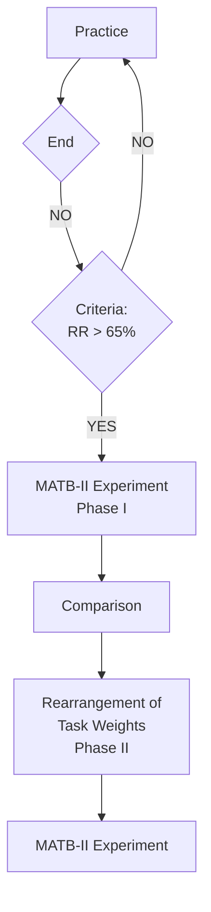

Computers in Human Behavior 84 (2018) 130–140

Contents lists available at ScienceDirect

# Computers in Human Behavior

journal homepage: www.elsevier.com/locate/comphumbeh

Full length article

# Quantitative modeling of user performance in multitasking environments

Shijing Liu, Chang S. Nam*

Edward P. Fitts Department of Industrial and Systems Engineering, North Carolina State University, Raleigh, NC 27695, USA

## ARTICLE INFO

**Article history:**
Received 20 October 2017
Received in revised form
29 January 2018
Accepted 23 February 2018
Available online 25 February 2018

**Keywords:**
* Multitasking
* Quantitative modeling
* MATB-II
* Working memory capacity
* Task difficulty
* Mental workload

## ABSTRACT

Multitasking is one of the most important skills required for human operators to perform highly-complex and safety-critical jobs. This study proposed and validated a quantitative model for the study of user performance improvement in a multitasking environment. The Multi-Attribute Task Battery-II (MATB-II) was used in the experiments as a multitasking platform. The proposed model included quantification of stimuli from each MATB-II subtask as baud rate (bits per second), selection of task difficulty and task weight, as well as the rearrangement of task weights. This research followed a two-phase experimental approach. The first phase applied the proposed model and identified a performance baseline for each individual in a multitasking environment, MATB-II. The second phase validated the proposed model using a rearranged set of multitasks for each individual. Individual differences in working memory capacity (WMC) have been estimated as predictors of varying cognitive abilities. This study also investigated the relationship between WMC, task difficulty, and multitasking performance. Significant improvement of user performance was found after the rearrangement of tasks based on the proposed approach. This research provides a framework to quantitatively evaluate multitasking systems and improve human performance in order to understand the interaction between systems and human operators.

© 2018 Elsevier Ltd. All rights reserved.

## 1. Introduction

Performing more than one task at a time in highly-complex and safety-critical jobs is increasingly common in modern life, such as air traffic controllers concurrently performing navigation, communication, and coordination, or commercial vehicle drivers talking on the phone and looking at the radio while driving (Colom, Martínez-Molina, Shih, & Santacreu, 2010; König, Buhner, & Murling, 2005; Lin, 2013). In general, multitasking is defined as the human ability to engage in a variety of tasks simultaneously through task switching (Delbridge, 2000; Hambrick, Oswald, Darowski, Rench, & Brou, 2010; Junco & Cotten, 2012). Due to the increasing complexity of our modern, technology-driven society, people are increasingly engaged in multitasking and there are many advantages to this. For instance, completing tasks simultaneously can save time and increase productivity (Colom et al., 2010; Spink, Park, Jansen, & Pedersen, 2006). However, when tasks increase in complexity, the required mental workload tends to increase and maintaining task performance within an acceptable level becomes more challenging (Arico et al., 2014). The increased demand of cognitive resources may exceed the limitation of the human cognitive system, therefore leading to performance degradation and an increase in errors (Arico et al., 2014; Du & Spink, 2011).

Working memory is known to be responsible for certain cognitive functions in multitasking, such as temporary storage and manipulation of the information necessary for a wide range of complex cognitive activities (Baddeley & Hitch, 1974; Colom et al., 2010; König et al., 2005). Increasing evidence has shown that individual differences in working memory capacity (WMC) were important predictors of various cognitive abilities (Engle & Kane, 2004; Kane & Engle, 2003; Redick & Engle, 2006; Unsworth, Heitz, Schrock, & Engle, 2005).

### 1.1. Modeling of multitasking performance

To evaluate and predict user performance in a multitasking environment, various types of cognitive models and approaches have been proposed in previous research. The studies of

* Corresponding author.
E-mail address: csnam@ncsu.edu (C.S. Nam).

https://doi.org/10.1016/j.chb.2018.02.035
0747-5632/© 2018 Elsevier Ltd. All rights reserved.

---

S. Liu, C.S. Nam / Computers in Human Behavior 84 (2018) 130–140                                     131

multitasking usually examined how well each task would be performed in a multiple task combination, in comparison with how each task would be performed alone (Wickens, Hollands, Banbury, & Parasuraman, 2015). These approaches can be separated into two categories: the first in which researchers focus on assessing the special human ability for multitasking, sometimes referred to as the "ability of time sharing" (Brookings, 1990; Hambrick et al., 2010; Horrey & Wickens, 2004); the second in which the researchers focus more broadly on multitasking as a class of situations (Hambrick et al., 2010; Spink, Cole, & Waller, 2008) and this approach was applied in this study to get a better understanding of human performance in multitaskings.

Various cognitive models have quantitatively analyzed human performance in single or multitasking scenarios. Many models discussed the quantification of information in a system with the human operator as a transmitter of information, for instance, the applications of Hick-Hyman law (Hick, 1952; Hyman, 1953) and Fitts law (Fitts, 1954), either singly or in combination (e.g., Clark & Ivry, 2010; Corbett et al., 2013; Phillips, Repperger, Kinsler, Bharwani, & Kender, 2007; Seow, 2005). These models are originally derived from Shannon's Theory, a fundamental theorem of communication systems (Shannon, 1948). A major achievement of these cognitive models of human-computer interaction is the quantification of information transmitted from the system as a baud rate (bits per second) (Crossman, 1960; Repperger, Phillips, & Chelette, 1995). These cognitive models paved the way for researchers to interpret the relationship between human performance and multitasking. However, it is still unclear how to improve human performance in multitasking through a quantitative approach. With respect to multitasking performance, mental effort is used to describe the amount of information processing resources. Previous studies have verified that a greater mental effort is required to maintain performance as task difficulty increases if the tasks are resource limited (Backs & Seljos, 1994; Durkee, Geyer, Pappada, Ortiz, & Galster, 2013). The manipulation of task difficulty has been an effective method for inducing varying levels of operator workload (Durkee et al., 2013; Fournier, Wilson, & Swain, 1999), and has been broadly applied in studies on workload and multitasking performance. Though task difficulty has been selected as an effective method to manipulate mental effort and decision making demands, there are limited instructions pertaining to the manipulation of task difficulty using a quantitative model and referring to the information processing resources.

study argued that it is difficult to achieve true parallel performance in practice, since human attention cannot be divided among many tasks simultaneously (Salvucci & Taatgen, 2011). Previous studies on cognitive modeling also reveal that the application of different multitasking strategies will affect performance and impact safety (Brumby, Howes, & Salvucci, 2007; Brumby et al., 2009; Kaber & Kim, 2011; Zhang & Hornof, 2014). Comparison between these two types of task strategies has been explored in some studies on multitasking and results revealed that human performance can be better predicted by a parallel strategy or that a human operator can perform at a higher level under a parallel strategy with limited resources (Brumby et al., 2009, 2007; Fischer & Plessow, 2015; Sigman & Dehaene, 2008). Therefore, a parallel task strategy was applied in this study to better construct the model and better instruct users in system operation.

## 1.2. Multitasking strategy

To multitask, the human operator needs to shift attention to perform several independent but concurrent tasks. Benbunan-Fich, Adler, and Mavlanova (2011) implied that there are some temporal overlaps in a specific period of time during multitasking. To overcome these temporal overlaps, different task strategies have been evaluated and compared in previous studies. There are two types of task strategies that have been discussed and evaluated in much of the research on multitasking performance: serial and parallel strategies (Benbunan-Fich et al., 2011; Brumby, Salvucci, & Howes, 2009; Kaber & Kim, 2011; Zhang & Hornof, 2014).

In a serial strategy, operator completes each task in sequence and each task starts after the completion of the previous one (Bluedorn, Kaufman, & Lane, 1992). Although there is no temporal overlap between tasks, Benbunan-Fich et al. (2011) implied that the serial approach can be useful to establish a baseline for comparing user performance with different types of multitasking approaches. In a parallel strategy, operator needs to handle all concurrent tasks at the same time (Bluedorn et al., 1992). Therefore, there is a maximum degree of temporal overlap of these tasks. Previous

## 1.3. Individual differences in multitasking

The topic of individual differences has been widely addressed in research on user performance and behavior. With the increase of complex automated systems, exploration of individual differences in multitasking performance may provide insight into personnel selection (Salomon, Ferraro, Petros, Bernhardt, & Rhyner, 2015). Specific characteristics have frequently been used as criteria for selecting individuals who may be well suited for a particular task or job (Hurtz & Donovan, 2000).

Research on personality measures in multitasking usually include attention (Kane & Engle, 2003), intelligence (Colom et al., 2010; Salomon et al., 2015), working memory capacity (WMC) (Colom et al., 2010; Kane & Engle, 2003; Liu, Wadeson, Kim, & Nam, 2016; Söqvist, 2010), processing speed (Hambrick et al., 2010), the ability of task switching (Liu et al., 2016; Sanchez-Cubillo et al., 2009), timesharing ability (Brookings, 1990; Wickens, Mountford, & Schreiner, 1981), and many other aspects of individual differences. In addition to these individual characteristics, WMC has also been examined in multitasking research as an important predictor of varying cognitive abilities (Engle & Kane, 2004; Kane & Engle, 2003). It has been shown to predict performance in various cognitive tasks, e.g., following directions, writing, note-taking, computer language learning, and bridge playing (Engle & Kane, 2004; Redick & Engle, 2006; Unsworth et al., 2005). But only a limited amount of research has explored the relationship between individual differences in WMC and multitasking performance through a quantitative model.

## 1.4. Research goals and hypotheses

Previous studies have demonstrated different approaches for evaluating and improving user performance in a multitasking environment. Individual differences in WMC have also been investigated in multitasking environments. However, studies in the area of multitasking still present significant gaps: (1) few studies have quantitatively analyzed the information processing and user performance in multitasking, and there is a general lack of a quantitative approach to improve multitasking performance; and (2) the relationship between WMC, task difficulty, and user performance in multitasking still remains open. To overcome these limitations, this study was intended to (1) propose and validate a quantitative model for user performance and improvement in a multitasking environment; and (2) investigate the relationships between WMC, task difficulty, and multitasking performance. The Multi-Attribute Task Battery-II (MATB-II) was used in the experiments as a multitasking platform. The MATB-II is a computer-based platform providing a set of tasks that are similar to the activities
---

132                    S. Liu, C.S. Nam / Computers in Human Behavior 84 (2018) 130–140

that operated by flight crews but also can be performed by non-pilot subjects.

A quantitative approach was proposed to investigate multitasking performance in this research. Then, a two-phases experimentation was conducted. The objectives of the first phase were to apply the proposed model in a multitasking environment and identify a performance baseline for each participant. The second phase aimed to validate the proposed model by rearranging a set of multitasks and comparing user performance with the baseline performance obtained in the first phase. The effects of individual differences in WMC and task difficulty were investigated at the end of the experiments.

This paper is organized as follows: Section 2 introduces the proposed quantitative model for the improvement of user performance in multitasking, Section 3 explains the two-phase experiment, Section 4 shows the results from experiment, Section 5 and 6 discusses the findings and research limitations.

## 2. The proposed quantitative model for user performance in multitasking

A quantitative approach was proposed to investigate and improve multitasking performance based on information theory (Shannon, 1948) and cross-entropy optimization (Fang, Rajasekera, & Tsao, 1997). This section introduced the proposed quantitative model. The proposed model included quantification of stimuli as baud rate (bits per second), selection of task difficulty and task weight, and rearrangement of task weights. Fig. 1 shows the multitasking platform used in this study, MATB-II (Santiago-espada, Myer, Latorella, & Comstock, 2011).

Five MATB-II tasks were tested in this study: Light, Scale, Tracking (TRACK), Communication (COMM), and Resource Management (RESMAN). For the Light task, participants needed to make a response to the absence of the green light (F5) and the presence of the red light (F6). For the Scale task, participants needed to monitor the four moving scales (F1, F2, F3, F4) and click on the bars when they detected a deviation from the midpoint. For the COMM task, audio messages with particular "call sign" were played and participants were required to listen to the content and respond by selecting the appropriate radio channel and frequency on the display. A joystick is required for the tracking task in MATB-II. When the TRACK task was under manual mode, participants were asked to use a joystick with their left hands to keep the circular target in the center of the tracking window (the non-dominant hand was selected since tracking task was not a primary task in this study (Phillips et al., 2013; Rupp, Oppold, & McConnell, 2014)). For the RESMAN task, participants were asked to maintain the level of fuel in tanks A and B within ±500 units of the initial condition of 2500 units each.

### 2.1. Quantification of information

To quantify the stimuli generated from a multitasking system, this model converted the information content of the stimuli into a baud rate (bits per second or bps) based on Shannon's information theory (1948) and previous studies (Camden, Nickels, Fendley, & Phillips, 2016; Liu et al., 2016; Phillips et al., 2007; Repperger et al., 1995). Baud rate was defined as "spatial information, in bits, divided by temporal information, in seconds" (Camden et al., 2016, p. 137) in this study, representing the rate that information was

[The Multi-Attribute Task Battery II (MATB-II) interface shown in Fig. 1 displays a complex software interface with multiple sections:

- System Monitoring section (top left) showing F5 and F6 lights and four vertical bar scales (F1-F4)
- Tracking section (top center) with crosshairs and coordinate displays (X axis, Y axis, Angle, Compass Point, Velocity, Scale Factor)
- Scheduling section (top right) with a timeline display showing numbered blocks
- Communications section (bottom left) showing radio frequencies for NAV1, NAV2, COM1, and COM2 with call sign NASA504
- Resource Management section (bottom center) displaying tank levels and pump controls with values like 800, 2448, 1000
- Flow Rates section (bottom right) showing numbered flow rates 1-8, all displaying 0
- Various control buttons and status indicators throughout the interface]

Fig. 1. Multi-attribute task battery II.
---

S. Liu, C.S. Nam / Computers in Human Behavior 84 (2018) 130–140                                         133

transmitted in a communication channel, measured in bps.

MATB-II involves five tasks: Light, Scale, Tracking (TRACK), Communication (COMM), and Resource Management (RESMAN). For each task, when all decision alternatives are assumed to be equally likely, the information content of a stimulus set, in bits, can be denoted as Hs(i) = log2[j(i)]. To measure the capacity of each task, the baud rate of task i, B(i), is defined as

$$B(i) = \frac{Hs(i)}{\Delta T(i)} \quad \text{or} \quad B(i) = \frac{\log_2[j(i)]}{\Delta T(i)}$$

where i represents MATB-II tasks (e.g., Light, Scale, TRACK, COMM, and RESMAN). j is the total number of stimuli per set. Hs(i) is the information content of a stimulus set. δT(i) is the duration of task i (time interval between start of one stimulus and start of next occurring stimulus).

## a Baud Rate for SYSMON Task

There are two subtasks included in the System Monitoring (SYSMON) task window: Lights (upper) and Scales (bottom). For the Lights task, each light sends out two signals ("ON" and "OFF") and the operator only needs to respond to one of them (the green light and the presence of the red light). Therefore, there are four decision alternatives in the Lights task, j(L) = 4, and green and red lights are equally weighted. The baud rate for the Lights task with a predefined δT (e.g., 10 s) is shown below:

$$\Delta T(L) = 10 \text{ sec}; \quad B(L) = \frac{\log_2(4)}{10} = 0.2 \text{ bps}$$

For the Scales task, there are four moving scales and the operator needs to click on the scales when s/he detects a deviation from the midpoint. Each scale has two directions and there are eight decision alternatives for the Scales task, j(S) = 8, and they are equally weighted (pS = 0.125). The baud rate for the Scales task with a predefined ΔT (e.g., 15 s) is shown below:

$$\Delta T(S) = 15 \text{ sec}; \quad B(S) = \frac{\log_2(8)}{15} = 0.2 \text{ bps}$$

## b Baud Rate for COMM Task

During the COMM tasks, audio messages with particular "Call Sign" (e.g., "NASA504") are played and the operator is required to listen to the content and respond by selecting the appropriate radio channel and frequency on the display. There are four channels for the operator to select, j(C) = 4, and they are equally weighted. The baud rate for the COMM task with a predefined ΔT (e.g., 10 s) is shown below:

$$\Delta T(C) = 10 \text{ sec}; \quad B(C) = \frac{\log_2(4)}{10} = 0.2 \text{ bps}$$

## c Baud Rate for RESMAN Task

During the Resource Management tasks, the operator is required to maintain the level of fuel in tanks A and B within the target ranges (e.g., a shaded area on the outside of each tank). In order to maintain the fuel level in tanks A and B, the operator must transfer fuel from the lower supply tanks through the use of the pumps. There are eight pumps and each of them has three states ("ON", "OFF", and "FAILED") and the pump is only operative when it is at the "ON" and "OFF" states. Therefore, each pump will send out three signals and the operator only needs to respond to two of them. There are 16 decision alternatives for the eight pumps in the RESMAN task, j(RM) = 16, and they are equally weighted. The baud rate for the RESMAN task with a predefined ΔT (e.g., 20 s) is shown below

$$\Delta T(RM) = 20 \text{ sec}; \quad B(RM) = \frac{\log_2(16)}{20} = 0.2 \text{ bps}$$

## d Baud Rate for TRACK Task

The TRACK task is a perturbation–rejection task and it involves a moving circle which represents the cursor and a fixed circle located in the center of the tracking window which represents the target that the cursor has to track during the task. The information capacity of the TRACK task can be estimated based on Fitts' law (1954). The index of performance (IP) is analogous to channel capacity in Shannon's theory and IP is calculated by task's index of difficulty (ID) and the movement time (MT): IP = ID/MT where

$$ID = \log_2\left(\frac{2A}{W}\right)$$

During the operation, TRACK requires subject to maintain the cursor on target. The information content of TRACK task is

$$Hs(T) = \log_2\left(\frac{2A}{W_D}\right)$$

Then, the baud rate of TRACK task, B(T), is

B(T) = log2[2A/W]/ΔT. The effective width (W) and the displacement of the cursor from the target center depend on the cursor velocity during the operation. The MATB-II has three fixed levels of the cursor velocity of TRACK task and the baud rates, B(T), of TRACK task are B(T)low = 0.24 bps; B(T)medium = 0.69 bps; and B(T)high = 0.93 bps (Phillips et al., 2007).

## 2.2. Determination of overall baud rate and task weight

The overall baud rate for MATB-II tasks is the summation of the baud rate from all subtasks, denoted as BTOT. Then, BTOT = ∑ B(i). A task weight is assigned to each MATB-II subtask, denoted as w(i) for subtask i. It is based on the baud rate for task i and the overall baud rate of the system. Then, w(i) = B(i)/BTOT.

Levels of task difficulty of the system are determined by different levels of BTOT.

To assess user performance, the operator's responses are recorded through the system. During the MATB-II operation, the human operator generates an output baud rate for each MATB-II task, denoted as BH(i). The human output baud rate for each task is based on the response ratio for task i, RR(i). The response ratio is defined as the correct responses per trial for subtask i and denoted as RR(i).

$$RR(i) = \frac{\text{Number of Correct Responses of Subtask i in a Trial}}{\text{Total Number of Events of Subtask i in a Trial}}$$

Thus, a human output baud rate for task i is BH(i) = RR(i)B(i). The overall human output baud rate for the MATB-II operation is denoted as BHTOT. BHTOT = ∑ BH(i). A human output task weight, wH(i), is calculated based on the human output baud rate for task i and the overall human output baud rate. Then, wH(i) = BH(i)/BHTOT.
---

134                                             S. Liu, C.S. Nam / Computers in Human Behavior 84 (2018) 130–140

## 2.3. Rearrangement of task weights

To overcome the limitation of baud rate selection (unbalanced between tasks) and improve overall multitasking performance for each human operator, this section introduces an approach to rearrange task weights for each participant.

The objective of the rearrangement approach is to maximize the overall human output baud rate with a fixed amount of the overall baud rate from MATB-II system. Thus, the objective function is BHTOT with a new set of task weights, w'(i). From the previous section, the objective function is equivalent to BTOT∑ RR(i)w'(i), because

$$B_{HTOT} = \sum B_H(i) = \sum RR(i)B(i)$$

$$B(i) = w'(i)B_{TOT}$$

$$B_{HTOT} = \sum RR(i)B(i) = \sum RR(i)w'(i)B_{TOT}$$

$$= B_{TOT} \sum RR(i)w'(i)$$

In the objective function, the BTOT is a constant. The goal of this approach is to find a set of solutions that maximize the summation of BTOT∑ RR(i)w'(i).

To achieve this goal, a cross-entropy optimization approach with cross-entropic constraints is applied (Fang et al., 1997, pp. 150–151). In this setting, the objective of this approach is to find a probability distribution, w'(i), that is the "closest" to a given a priori distribution, w(i), within a "deviation measure" of ε from a given set of distributions. This problem can be descripted as following forms:

Maximize        BTOT ∑ RR'(i)w'(i)
Subject to      ∑ w'(i) = 1
                RR'(i) = RR(i)
                0 < w'(i) < 1
                | CrossEnt[w(i), w'(i)] | ≤ ε

Where CrossEnt[w(i), w'(i)] is the cross-entropy of task weight and CrossEnt[w(i), w'(i)] = − ∑w(i) lnw'(i)/w(i).

In this setting, there are three sets of unknown variables, RR(i), w(i), and ε. Several assumptions based on the operation of MATB-II tasks are made: (1) the response ratio, RR(i), for task i is a constant for each human operator and the values of RR(i) are obtained from the operation of a set of equally weighted MATB-II tasks; (2) the human operator needs to pay attention to all MATB-II tasks during the operation, then, the new task weight for task i, w'(i), cannot be equal to 0 or 1; (3) the "deviation measure" of ε represents the system allowance and is defined by the system requirement in this study. A constant value is set up for ε (= 0.1) in this study since operators are expected to pay attention to all MATB-II tasks across all task conditions in this study. To meet this requirement and demonstrate the rearrangement approach, the subtasks in MATB-II were equally weighted initially to obtain a performance baseline from each operator.

This optimization problem can be solved with an optimization tool (e.g., LINGO 13.0) and one or more sets of solutions can be obtained to achieve an optimal value for BTOT∑ RR(i)w(i) or BHTOT. In this study, a new set of task weights, w'(i), was selected from the solutions for each human operator. A modified set of task baud rates, B'(i), was assigned to each operator according to B'(i) = BTOTw'(i). They were asked to perform the modified set of MATB-II tasks and it was expected that there would be an improvement of user performance after this rearrangement. In MATB-II tasks, the baud rate for TRACK task was three fixed values defined by the MATB-II system. Thus, B(T)'s were three constant values in calculation for all three levels of task difficulty in this study.

# 3. Method

To validate the proposed model, two phases of experimentation were conducted. The objectives of the first phase were to apply the proposed model in a multitasking environment and identify a performance baseline for each participant. The second phase aimed to validate the proposed model by rearranging a set of multitasks and comparing user performance with the baseline performance obtained in the first phase. The effects of individual differences in WMC and task difficulty were investigated at the end of the experiments.

## 3.1. Participants

Twenty-five participants (11 male, 14 female, average age = 19.64, SD = 1.85) were recruited from a local university for this study. The sample size of this study was determined by the data from a pilot study (two participants) using a conventional power level, 0.8, for the statistical model (Cohen, 2016; Thomas & Juanes, 1996). All participants had normal hearing and normal or corrected-to-normal vision. Only right-handed participants were recruited for this study due to the operation of MATB-II and to avoid the influence of handedness on the experiment. In addition, English was required as a native language of all participants. All participants had no previous experience with MATB-II or similar training.

## 3.2. Apparatus and materials

Before the experiment, a demographic questionnaire and a handedness survey were provided to each participant. The handedness survey was based on the Edinburgh Handedness Inventory (Oldfield, 1971). The operation span task (OSPAN) (Turner & Engle, 1989) has been established as a reliable and valid marker of WMC. An automated version of OSPAN was employed in this study (Unsworth et al., 2005) since it is easy-to-administer and requires little intervention from experimenter that participants can complete it online by themselves. Each participant was required to complete an automated OSPAN test to evaluate their WMC.

The Multi-Attribute Task Battery II (MATB-II) (Santiago-espada et al., 2011) was employed in this study as a platform to assess multitasking. Five MATB-II tasks were tested in this study (see Fig. 1). All participants were required to use a mouse with their right hands (dominant hands) to make response to Light, Scale, COMM, and RESMAN tasks and use their left hands to control a joystick to perform TRACK task. A NASA-TLX questionnaire was presented after each trial and a NASA-TLX pairwise comparisons of factors form was completed by each participant at the end of the experiment (Hart & Staveland, 1988) to evaluate the mental workload during operation.

## 3.3. Independent variables

There were two independent variables included in this study: task difficulty and WMC.

Task difficulty: Task difficulty was manipulated by different levels of overall baud rate, BTOT, of MATB-II tasks. There were three levels of task difficulty in the two-phase experiment: low, medium, and high. Each level of task difficulty was manipulated through the overall baud rate, BTOT. To determine the performance baseline, a set of equally weighted multitasks with three levels of task
---

S. Liu, C.S. Nam / Computers in Human Behavior 84 (2018) 130–140                135

**Table 1**
Baud rate and task difficulty in phase I.

<table>
<thead>
<tr>
<th>Task Difficulty</th>
<th></th>
<th>Low</th>
<th>Medium</th>
<th>High</th>
</tr>
</thead>
<tbody>
<tr>
<td rowspan="4">Time interval (second)</td>
<td>ΔT(L)</td>
<td>20</td>
<td>10</td>
<td>5</td>
</tr>
<tr>
<td>ΔT(S)</td>
<td>30</td>
<td>15</td>
<td>7</td>
</tr>
<tr>
<td>ΔT(C)</td>
<td>20</td>
<td>10</td>
<td>5</td>
</tr>
<tr>
<td>ΔT(RM)</td>
<td>40</td>
<td>20</td>
<td>10</td>
</tr>
<tr>
<td rowspan="6">Baud Rate (bps)</td>
<td>B(L)</td>
<td>0.1</td>
<td>0.2</td>
<td>0.4</td>
</tr>
<tr>
<td>B(S)</td>
<td>0.1</td>
<td>0.2</td>
<td>0.43</td>
</tr>
<tr>
<td>B(C)</td>
<td>0.1</td>
<td>0.2</td>
<td>0.4</td>
</tr>
<tr>
<td>B(RM)</td>
<td>0.1</td>
<td>0.2</td>
<td>0.4</td>
</tr>
<tr>
<td>B(T)</td>
<td>0.24</td>
<td>0.69</td>
<td>0.93</td>
</tr>
<tr>
<td>BTOT</td>
<td>0.64</td>
<td>1.49</td>
<td>2.56</td>
</tr>
</tbody>
</table>

difficulty was completed by each participant during Phase I. Table 1 shows the baud rate and task difficulty for Phase I.

During Phase II, task weights were rearranged according to the baseline performance for each individual in Phase I. Though the baud rate for each MATB-II subtask was adjusted, the overall baud rate, BTOT, maintained the same value for each level of task difficulty in Phase I (e.g., BTOT = 0.64, 1.49, and 2.49 bps, for low, medium, and high level, respectively).

**Working Memory Capacity:** WMC was assessed by the automated OSPAN test. The potential OSPAN scores ranged from 0 to 75 of the WMC test, participants' OSPAN scores covered a relative wide range (28–75) in this study.

### 3.4. Dependent variables

To validate the proposed model and investigate the effects of task difficulty and WMC on multitasking performance, the two-phase experiment collected two types of dependent variables: MATB-II performance and subjective workload.

#### 3.4.1. MATB-II performance

MATB-II performance included average response time (RT) for Light, Scale, and COMM tasks, response ratio (percentage of correct response per trial, RR) for Light, Scale, COMM, and RESMAN tasks, as well as root mean square deviation (RMSD) for TRACK task.

**Average response time (RT(i)).** When the stimulus of an event was first triggered, RT(i) was the average time taken for the participant to respond to each event of the MATB-II subtask i within each trial. The index i represented each MATB-II subtask.

**Response Ratio (RR(i)).** RR(i) was the percentage of correct responses of MATB-II subtask i during each experimental trial. The index i represented each MATB-II subtask.

**Root mean square deviation (RMSD).** RMSD from center point was calculated and recorded along with the number of samples during a predefined interval for TRACK task. RMSD was in pixel units.

#### 3.4.2. Subjective workload

At the end of each experimental trial, a workload rating scale (WRS) was presented to the participant. It was a NASA-TLX rating scale and included six parts: mental demand (MD), physical demand (PD), temporal demand (TD), the individual's perceived level of performance (PE), effort (EF), and frustration (FR). A NASA-TLX pairwise comparisons of factors form (Hart & Staveland, 1988) was provided at the end of MATB-II experiment sessions of both Phase I and Phase II for each participant. The weighted NASA-TLX rating score was calculated and used as an indicator of WRS.

### 3.5. Procedures

Upon initial contact with the potential participants, an online screening session was required, including a demographic

questionnaire and a handedness survey to verify their age, native language, health condition, and handedness. If they were qualified, an online WMC test (the automated OSPAN test) was required to complete by themselves before Phase I experiment.

The two-phase experiments were conducted in a laboratory environment. At the beginning of Phase I experiment, an informed consent form was provided to each participant. Then, an instruction of the experiment was provided including an introduction of the procedure of two phases and an instruction of MATB-II tasks.

During Phase I, a 2-h practice sessions of multitasks in MATB-II was required for each participant before the experimental session. Each participant completed twelve 5-min trials of MATB-II tasks for practice. The twelve trials covered three levels of task difficulty and there were four replicates in each level. The order of these practice trials were randomized for each participant. Users' performance was recorded during practice. At the end of the practice session, if the participant had an average RR of 65% or higher at the medium level of task difficulty trials, s/he was invited to participate in both Phase I and Phase II experimental sessions (Bowers, Christensen, & Eggemeier, 2014). Fig. 2 shows the experimental procedure of this research.

During the MATB-II experiment session of Phase I, participants' task performance was recorded and evaluated as their performance baseline. Before Phase II experiment session, a rearranged set of MATB-II tasks was provided for each participant by following the task weights rearrangement approach (see section 2.3). Table 2 shows an example of the rearrangement of task weights for one participant across all three levels of task difficulty. TRACK task had a fixed baud rate at each level of task difficulty, so the rearrangement of task weights was only performed for Light (L), Scale (S), COMM (C), and RMAN (RM) tasks.

During the rearrangement of task weights, the summation of task weights for Light (L), Scale (S), COMM (C), and RMAN (RM) tasks was 0.625, 0.537, and 0.637 at low, medium, and high level, respectively. For the participant shown in Table 2, the results of the cross-entropy of task weight, CrossEnt[w(i), w'(i)], for each task in MATB-II across all three levels of task difficulty are shown in Table 3. The range of the cross-entropy of task weight for this participant was [-0.094, 0.098].

### 3.6. Experiment design and statistical data analysis

To investigate the effects of task difficulty and WMC on multitasking performance, analysis of variance (ANOVA) was applied. This study was a split-plot design with participants as whole plot

**Fig. 2.** Experimental procedure.
---

136                                   S. Liu, C.S. Nam / Computers in Human Behavior 84 (2018) 130–140

**Table 2**  
Example of task weights rearrangement.

<table>
<thead>
<tr>
<th></th>
<th></th>
<th colspan="3">Task Difficulty</th>
</tr>
<tr>
<th></th>
<th></th>
<th>Low</th>
<th>Medium</th>
<th>High</th>
</tr>
</thead>
<tbody>
<tr>
<td rowspan="5">Initial Task Weights (Phase I)</td>
<td>w(L)</td>
<td>0.156</td>
<td>0.134</td>
<td>0.156</td>
</tr>
<tr>
<td>w(S)</td>
<td>0.156</td>
<td>0.134</td>
<td>0.168</td>
</tr>
<tr>
<td>w(C)</td>
<td>0.156</td>
<td>0.134</td>
<td>0.156</td>
</tr>
<tr>
<td>w(RM)</td>
<td>0.156</td>
<td>0.134</td>
<td>0.156</td>
</tr>
<tr>
<td>w(T)</td>
<td>0.376</td>
<td>0.464</td>
<td>0.363</td>
</tr>
<tr>
<td rowspan="4">Performance Baseline (RR)</td>
<td>RR(L)</td>
<td>1</td>
<td>0.98</td>
<td>0.96</td>
</tr>
<tr>
<td>RR(S)</td>
<td>1</td>
<td>0.97</td>
<td>0.96</td>
</tr>
<tr>
<td>RR(C)</td>
<td>0.95</td>
<td>0.93</td>
<td>0.77</td>
</tr>
<tr>
<td>RR(RM)</td>
<td>0.93</td>
<td>0.91</td>
<td>0.88</td>
</tr>
<tr>
<td rowspan="5">Rearranged Task Weights (Phase II)</td>
<td>W'(L)</td>
<td>0.176</td>
<td>0.160</td>
<td>0.166</td>
</tr>
<tr>
<td>W'(S)</td>
<td>0.176</td>
<td>0.151</td>
<td>0.187</td>
</tr>
<tr>
<td>W'(C)</td>
<td>0.138</td>
<td>0.113</td>
<td>0.134</td>
</tr>
<tr>
<td>W'(RM)</td>
<td>0.134</td>
<td>0.112</td>
<td>0.150</td>
</tr>
<tr>
<td>w(T)</td>
<td>0.376</td>
<td>0.464</td>
<td>0.363</td>
</tr>
</tbody>
</table>

Note: w(i) = initial task weight of task i; w'(i) = rearranged task weight of task i.

and experimental trials as split plots. The treatment factors included WMC as the whole plot factor and task difficulty as the split plot factor. The model of the experiment design in this study is as follows:

$$y_{ijk} = \mu + \alpha_i + \varepsilon (W)_{ij} + \beta_k + (\alpha\beta)_{ik} + \varepsilon(S)_{ijk}$$

Where:

yijk = response variable (response ratio (RR), response time (RT), RMSD in MATB-II; WRS score); μ = response mean;  
αi = whole plot main effect, WMC, i ∈ [0, 75];  
ε (W)ij = whole plot error, j = participant number; ε (W)ij ~ iid ~ N(0, σW2)  
βk = split plot main effect, task difficulty, j = 1, 2, 3;  
(αβ)ik = whole plot and split plot interaction;  
ε(S)ijk = split plot error; ε(S)ijk ~ iid ~ N(0, σS2)

Before perform ANOVA, the assumptions of homoscedasticity and residual normality were examined using Bartlett's test (Garson, 2012) and Shapiro-Wilk normality test (Shapiro & Wilk, 1965), respectively. For any data sets that did not satisfy the assumptions of homoscedasticity or residual normality, transformations were applied to the response variables (e.g., log transformation). Given the transformations were ineffective, the average ranks of response variables were applied as an alternative to a nonparametric analysis. None of the response variables or their transformations satisfied the homoscedasticity and residual normality assumptions. Since the results using the average ranks produced similar results to ANOVAs using the original measures for all response variables, analyses using original measures were considered valid (Montgomery, 1997) and were performed and are reported in the results section.

## 4. Results

### 4.1. Performance comparison between two phases

After the rearrangement of task weights in Phase II, user performance was recorded and compared with the baseline performance obtained from Phase I. Paired comparisons, two-tailed t-tests, of multitasking performance were conducted to validate the improvement of user performance after the rearrangement of task weights. Each response variable included all three levels of task difficulty.

#### 4.1.1. RT of MATB-II tasks

From the experiment, a trend of decrease in RT was observed across all three levels of task difficulty for all three tasks. To analyze the improvement between two phases, paired t-tests with Bonferroni correction (three levels of task difficulty) (Rice, 2006) were conducted. There were 25 participants and each participant took two trial for each level of task difficulty (N = 50). Table 4 shows a summary of results of the paired t-tests for RT of MATB-II tasks between Phase I and Phase II (p < 0.05/3 = 0.0167, three task difficulty levels).

The results implied the improvement of task performance by showing the decrease of RT in Phase II. According to the paired t-tests, RTs of Light and Scale tasks showed significant decrease (p < 0.0167) in second phase across all levels of task difficulty which supported hypothesis H1(a). For COMM task, significant improvement was not found for RT, but the results showed that the RT maintained at a stable range for each level of task difficulty (e.g., Low: 1.55s vs. 1.58s; Medium: 1.71s vs. 1.62s; High: 2.18s vs. 2.19s, for Phase I vs. Phase II, respectively).

#### 4.1.2. RR of MATB-II tasks

Table 5 shows the descriptive statistics of RR which implied that RR for MATB-II tasks maintained at a small range between two phases across all three levels of task difficulty.

To further investigate if there was an improvement of RR between two phases, paired t-tests with Bonferroni correction (Rice, 2006) were conducted. Only few significant results were detected for RR in MATB-II. None of the descriptive statistics or paired t-tests showed a general direction of RR between two phases. One of the assumptions of the proposed model was that the response ratio (RR) for MATB-II tasks would keep at a constant value for each subtask, which meant that RR for each MATB-II subtask would maintain at the same level between two phases. After the practice session, participants who reach a stable level of RR for MATB-II tasks were invited to following sessions of this study. During experiment sessions in both Phase I and II, participants maintained a relative high level of overall RR (>80%) for all MATB-II tasks. From the results, a small range of the overall RR was maintained between Phase I and Phase II across all three levels of task difficulty for each

**Table 4**  
Summary of Paired t-test Results for RT.

<table>
<thead>
<tr>
<th></th>
<th>Task Difficulty</th>
<th>N</th>
<th>DF</th>
<th>t-Ratio</th>
<th>p-value</th>
<th>Effect Size</th>
</tr>
</thead>
<tbody>
<tr>
<td rowspan="3">RT_Light</td>
<td>Low</td>
<td>50</td>
<td>49</td>
<td>−2.36</td>
<td>0.0111*</td>
<td>0.334</td>
</tr>
<tr>
<td>Medium</td>
<td>50</td>
<td>49</td>
<td>−4.84</td>
<td><0.0001**</td>
<td>0.684</td>
</tr>
<tr>
<td>High</td>
<td>50</td>
<td>49</td>
<td>−10.13</td>
<td><0.0001**</td>
<td>1.433</td>
</tr>
<tr>
<td rowspan="3">RT_Scale</td>
<td>Low</td>
<td>50</td>
<td>49</td>
<td>−2.22</td>
<td>0.0155*</td>
<td>0.566</td>
</tr>
<tr>
<td>Medium</td>
<td>50</td>
<td>49</td>
<td>−2.37</td>
<td>0.0109*</td>
<td>0.503</td>
</tr>
<tr>
<td>High</td>
<td>50</td>
<td>49</td>
<td>−6.57</td>
<td><0.0001**</td>
<td>0.347</td>
</tr>
<tr>
<td rowspan="3">RT_COMM</td>
<td>Low</td>
<td>50</td>
<td>49</td>
<td>0.25</td>
<td>0.6</td>
<td>0.178</td>
</tr>
<tr>
<td>Medium</td>
<td>50</td>
<td>49</td>
<td>−0.96</td>
<td>0.1716</td>
<td>−0.007</td>
</tr>
<tr>
<td>High</td>
<td>50</td>
<td>49</td>
<td>0.04</td>
<td>0.5139</td>
<td>−0.065</td>
</tr>
</tbody>
</table>

Note. * significance level: p < 0.0167. ** significance level: p < 0.0001.

**Table 3**  
Results of the cross-entropy of task weight.

<table>
<thead>
<tr>
<th></th>
<th></th>
<th colspan="3">Task Difficulty</th>
</tr>
<tr>
<th></th>
<th></th>
<th>Low</th>
<th>Medium</th>
<th>High</th>
</tr>
</thead>
<tbody>
<tr>
<td rowspan="4">CrossEnt[w(i), w'(i)]</td>
<td>L</td>
<td>−0.074</td>
<td>−0.094</td>
<td>−0.039</td>
</tr>
<tr>
<td>S</td>
<td>−0.074</td>
<td>−0.063</td>
<td>−0.068</td>
</tr>
<tr>
<td>C</td>
<td>0.078</td>
<td>0.092</td>
<td>0.098</td>
</tr>
<tr>
<td>RM</td>
<td>0.096</td>
<td>0.097</td>
<td>0.026</td>
</tr>
</tbody>
</table>

Note: CrossEnt[w(i), w'(i)] = −∑w(i) ln w'(i)/w(i)
---

S. Liu, C.S. Nam / Computers in Human Behavior 84 (2018) 130–140                                                          137

**Table 5**
Summary of RR mean (SD) of MATB-II Tasks.

<table>
<thead>
<tr>
<th rowspan="2">Task Difficulty</th>
<th colspan="3">Phase I</th>
<th colspan="3">Phase II</th>
</tr>
<tr>
<th>Low</th>
<th>Medium</th>
<th>High</th>
<th>Low</th>
<th>Medium</th>
<th>High</th>
</tr>
</thead>
<tbody>
<tr>
<td>RR_Scale</td>
<td>0.82 (0.28)</td>
<td>0.85 (0.23)</td>
<td>0.88 (0.16)</td>
<td>0.80 (0.30)</td>
<td>0.85 (0.26)</td>
<td>0.89 (0.16)</td>
</tr>
<tr>
<td>RR_COMM</td>
<td>0.93 (0.08)</td>
<td>0.93 (0.08)</td>
<td>0.85 (0.11)</td>
<td>0.95 (0.09)</td>
<td>0.92 (0.10)</td>
<td>0.90 (0.09)</td>
</tr>
<tr>
<td>RR_RMAN</td>
<td>0.89 (0.09)</td>
<td>0.89 (0.08)</td>
<td>0.86 (0.10)</td>
<td>0.92 (0.07)</td>
<td>0.90 (0.07)</td>
<td>0.88 (0.09)</td>
</tr>
</tbody>
</table>

**Table 7**
Summary of Paired t-test Results for Workload.

<table>
<thead>
<tr>
<th>Task Difficulty</th>
<th>N</th>
<th>DF</th>
<th>t-Ratio</th>
<th>p-value</th>
<th>Effect Size</th>
</tr>
</thead>
<tbody>
<tr>
<td rowspan="3">WRS</td>
<td></td>
<td></td>
<td></td>
<td></td>
<td></td>
</tr>
<tr>
<td>Low</td>
<td>50</td>
<td>49</td>
<td>−0.593</td>
<td>0.2779</td>
<td>0.306</td>
</tr>
<tr>
<td>Medium</td>
<td>50</td>
<td>49</td>
<td>−1.624</td>
<td>0.0554*</td>
<td>0.233</td>
</tr>
<tr>
<td></td>
<td>High</td>
<td>50</td>
<td>49</td>
<td>−2.6313</td>
<td>0.0057</td>
<td>0.141</td>
</tr>
</tbody>
</table>

Note. * significance level: p < 0.0167. ** significance level: p < 0.0001.

subtask. The results of RR of MATB-II tasks in two phases validated the assumption of the approach of task weight rearrangement in the proposed model.

### 4.1.3. RMSD of TRACK task

From the experiment, a trend of decrease of RMSD was implied for all three levels of task difficulty between two phases. To analyze the differences in RMSD between two phases, paired t-tests with Bonferroni correction (Rice, 2006) were conducted. Table 6 shows a summary of results of the paired t-tests for RMSD between Phase I and Phase II (p < 0.05/3 = 0.0167, three task difficulty levels).

The results in Table 6 showed a significant or marginally significant decrease in RMSD at each level of task difficulty. This result indicated the improvement of user performance on the tracking task during Phase II.

### 4.1.4. Subjective workload

Paired t-tests with Bonferroni correction (Rice, 2006) were conducted to investigate the changes in workload between two phases. Table 7 shows a summary of results of the paired t-tests for workload between Phase I and Phase II (p < 0.05/3 = 0.0167, three task difficulty levels).

From the comparison of WRS between two phases, a significant decrease was found for WRS at high level (p = 0.0057) of task difficulty. WRS did not show a significant decrease between two phases at the low task difficulty level (e.g., Low: 40.29 (Phase I) vs. 39.20 (Phase II)) or medium level (e.g., Medium: 49.54 (Phase I) vs. 46.07 (Phase II)), which is likely due to the ease of completing the task at these difficulty levels.

## 4.2. Effects of task difficulty and WMC

The effects of task difficulty and working memory capacity (WMC) on multitasking performance for both Phase I and Phase II of the experiment were investigated by performing ANOVAs. The response variables included MATB-II task performance and subjective workload rating. In the statistical model for this split-plot design, WMC was the whole plot factor and task difficulty was the split plot factor. Since task difficulty included three levels, Tukey's HSD tests were performed if significant effects of task difficulty were found for any response variables.

### 4.2.1. RT of MATB-II tasks

During the two-phase experiment, RTs were collected for Light,

**Table 6**
Summary of Paired t-test Results for RMSD.

<table>
<thead>
<tr>
<th>Task Difficulty</th>
<th>N</th>
<th>DF</th>
<th>t-Ratio</th>
<th>p-value</th>
<th>Effect Size</th>
</tr>
</thead>
<tbody>
<tr>
<td rowspan="3">RMSD</td>
<td>Low</td>
<td>50</td>
<td>49</td>
<td>−2.17</td>
<td>0.0173</td>
<td>0.532</td>
</tr>
<tr>
<td>Medium</td>
<td>50</td>
<td>49</td>
<td>−3.95</td>
<td>0.001*</td>
<td>0.569</td>
</tr>
<tr>
<td>High</td>
<td>50</td>
<td>49</td>
<td>−5.57</td>
<td><0.0001**</td>
<td>0.527</td>
</tr>
</tbody>
</table>

Note. * significance level: p < 0.0167. ** significance level: p < 0.0001.

Scale, and COMM tasks. Table 8 shows the significant effects of task difficulty and WMC on RT in MATB-II tasks.

The results from ANOVA revealed significant effects for both task difficulty and WMC on RT of MATB-II tasks. No significant interaction effect was found. The whole plot main effect, WMC, showed significant effects on RT in three MATB-II tasks, Light (F(1, 295) = 7.62, p = 0.0061), Scale (F(1, 295) = 5.60, p = 0.0186), and COMM (F(1, 295) = 20.90, p < 0.0001). These results showed that participants with high WMC had a lower RT of MATB-II tasks than those with low WMC. The split plot main effect, task difficulty, also showed significant effects on RT in three MATB-II tasks, Light (F(2, 295) = 5.93, p = 0.003), Scale (F(2, 295) = 12.98, p < 0.0001), and COMM (F(2, 295) = 38.21, p < 0.0001). These findings implied the increase of RT with the increase of task difficulty for MATB-II tasks.

Tukey's HSD test was performed for RT of each task. For Light task, RT at low level (mean = 2.19, SD = 0.64) was significantly shorter than RT at medium level (mean = 2.52, SD = 0.78). For Scale task, a trend of increase of RT was detected and RT at high level (mean = 4.78, SD = 1.47) was significantly longer than RTs at low level (mean = 3.74, SD = 1.51) and medium level (mean = 4.18, SD = 1.37). For COMM task, a trend of increase of RT was also revealed and RT at high level (mean = 2.16, SD = 0.48) was significantly longer than RTs at low level (mean = 1.57, SD = 0.60) and medium level (mean = 1.67, SD = 0.58).

### 4.2.2. RR of MATB-II tasks

During the two-phase experiment, RR were collected for Light, Scale, COMM, and RMAN tasks. Table 9 shows the significant effects of task difficulty and WMC on RR in MATB-II tasks.

The results from ANOVA indicated several significant effects of task difficulty and WMC on RR of MATB-II tasks. One significant interaction effect, task difficulty and WMC, was found for RR of Light task (F(2, 295) = 5.05, p = 0.007). The whole plot main effect, WMC, showed significant effects on RR in two MATB-II tasks, COMM (F(2, 295) = 8.10, p = 0.0047) and RMAN (F(2, 295) = 19.97, p < 0.0001). These results indicated that participants with high WMC produced a higher RR of MATB-II tasks than those with low WMC. The split plot main effect, task difficulty, showed significant effects on RR in three MATB-II tasks, Light (F(2, 295) = 68.57, p < 0.0001), COMM (F(2, 295) = 13.24, p < 0.0001), and RMAN (F(2, 295) = 3.92, p = 0.0208). These findings implied the decrease of RR with the increase of task difficulty for MATB-II tasks.

Tukey's HSD test was performed for RR of Light, COMM, and RMAN tasks. For Light task, RR at high level (mean = 93.97%,

**Table 8**
Summary of ANOVA results for RT.

<table>
<thead>
<tr>
<th></th>
<th>Effect</th>
<th>F-value</th>
<th>p-value</th>
</tr>
</thead>
<tbody>
<tr>
<td rowspan="2">RT_Light</td>
<td>Task Difficulty</td>
<td>F(2, 295) = 5.93</td>
<td>0.003**</td>
</tr>
<tr>
<td>WMC</td>
<td>F(1, 295) = 7.62</td>
<td>0.0061**</td>
</tr>
<tr>
<td rowspan="2">RT_Scale</td>
<td>Task Difficulty</td>
<td>F(2, 295) = 12.98</td>
<td><0.0001**</td>
</tr>
<tr>
<td>WMC</td>
<td>F(1, 295) = 5.60</td>
<td>0.0186*</td>
</tr>
<tr>
<td rowspan="2">RT_COMM</td>
<td>Task Difficulty</td>
<td>F(2, 295) = 38.21</td>
<td><0.0001**</td>
</tr>
<tr>
<td>WMC</td>
<td>F(1, 295) = 20.90</td>
<td><0.0001**</td>
</tr>
</tbody>
</table>

Note. * significance level: p < 0.05. ** significance level: p < 0.0001.
---

138                                                 S. Liu, C.S. Nam / Computers in Human Behavior 84 (2018) 130–140

**Table 9**
Summary of ANOVA results for RR.

<table>
<thead>
<tr>
<th></th>
<th>Effect</th>
<th>F-value</th>
<th>p-value</th>
</tr>
</thead>
<tbody>
<tr>
<td>RR_Light</td>
<td>Task Difficulty</td>
<td>F(2, 295) = 68.57</td>
<td>&lt;0.0001**</td>
</tr>
<tr>
<td></td>
<td>WMC</td>
<td>F(1, 295) = 1.52</td>
<td>0.2187</td>
</tr>
<tr>
<td></td>
<td>Task Difficulty *WMC</td>
<td>F(2, 295) = 5.05</td>
<td>0.007**</td>
</tr>
<tr>
<td>RR_Scale</td>
<td>Task Difficulty</td>
<td>F(2, 295) = 2.12</td>
<td>0.1224</td>
</tr>
<tr>
<td></td>
<td>WMC</td>
<td>F(1, 295) = 2.35</td>
<td>0.1262</td>
</tr>
<tr>
<td>RR_COMM</td>
<td>Task Difficulty</td>
<td>F(2, 295) = 13.24</td>
<td>&lt;0.0001**</td>
</tr>
<tr>
<td></td>
<td>WMC</td>
<td>F(1, 295) = 8.10</td>
<td>0.0047*</td>
</tr>
<tr>
<td>RR_RMAN</td>
<td>Task Difficulty</td>
<td>F(2, 295) = 3.92</td>
<td>0.0208*</td>
</tr>
<tr>
<td></td>
<td>WMC</td>
<td>F(1, 295) = 19.97</td>
<td>&lt;0.0001**</td>
</tr>
</tbody>
</table>

Note. * significance level: p < 0.05. ** significance level: p < 0.0001.

SD = 4.65%) was significantly lower than RR at low level (mean = 98.99%, SD = 3.62%) and medium level (mean = 99.03%, SD = 1.85%). For COMM task, RR at high level (mean = 87.67%, SD = 10.31%) was also significantly lower than RR at low level (mean = 94.01%, SD = 8.94%) and medium level (mean = 92.84%, SD = 8.86%). For RMAN task, RR at high level (mean = 87.18%, SD = 9.79%) was also significantly lower than RR at low level (mean = 90.34%, SD = 8.39%).

### 4.2.3. RMSD of TRACK task

Performance of TRACK task was assessed by the value of RMSD during the experiment. A significant effect of the split plot main effect, task difficulty, was indicated from the results of ANOVA. No significant interaction effect was found. During TRACK task, RMSD was significantly increased by the rise in task difficulty (F(2, 295) = 113.71, p < 0.0001). Tukey's HSD test was performed for RMSD of TRACK task. Significant differences in RMSD were found among all three levels of task difficulty. The value of RMSD at high level (mean = 43.61, SD = 16.51) was significantly higher than RMSD at low level (mean = 18.13, SD = 7.15) and medium level (mean = 29.07, SD = 10.41) in TRACK task.

### 4.2.4. Subjective workload

During the experiment, subjective workload rating scale (WRS) was collected to estimate mental workload of participants. No significant effect of WMC on WRS was found. A significant effect of the split plot main effect, task difficulty, was found for WRS from the results of ANOVA. No significant interaction effect was found. During the experiment, participants' WRS was significantly increased with the increase of task difficulty (F(2, 295) = 45.90, p < 0.0001). Tukey's HSD test was performed for WRS. Significant differences in WRS were found among all three levels of task difficulty. The WRS score at high level (mean = 63.15, SD = 16.13) was significantly higher than WRS score at low level (mean = 39.74, SD = 19.34) and medium level (mean = 47.80, SD = 17.20).

## 5. Discussion

### 5.1. Model improvement

The first research goal of this study was to validate a model proposed to quantify the information transmitted and processed between human operator and system, which can be used to evaluate and improve human performance in a multitasking environment. A quantitative model that converted the stimuli from system and human operator into a baud rate (bps) was proposed in this study based on information theory (Shannon, 1948). An approach, task rearrangement, to improve individuals' user performance in multitasking was included in the proposed model based on the cross-entropy optimization (Fang et al., 1997). To validate the proposed model, a two-phase experiment was conducted and

comparisons were performed between two phases to investigate the improvement of user performance after task rearrangement in the experiment. A practice session was conducted for each participant to eliminate the carryover effect of training in multitasking.

Statistical comparison between the two phases revealed that most of the response variables verified the performance improvement in Phase II across all three levels of task difficulty. After performed task rearrangement based on the performance baseline obtained from Phase I, a shorter RT and a lower RMSD of MATB-II tasks were detected among all three levels of task difficulty in Phase II experiment. For the RR of MATB-II tasks, all participants reached a stable relative high RR after practice session and maintained their RR at a small range during the two-phase experiment. This outcome validated one of the assumption of the proposed model that RR would maintain at a constant value between two phases. With regard to the changes in mental workload, significant decrease of subjective workload rating was found at high level of task difficulty in Phase II and a trend of decreased workload at low and medium levels was also implied by the descriptive statistics.

### 5.2. User performance and workload

The second research goal of this study was to investigate the relationship between WMC, task difficulty, and human performance in a multitasking environment. During the two-phase experiment, task difficulty was manipulated by the overall baud rate of the system and WMC was assessed by the automated OSPAN test (Unsworth et al., 2005). Two hypotheses were formulated to investigate their relationship.

Task difficulty was seen to be an effective method to manipulate demand in multitasking, which was observed not only through task performance metrics, but also through subjective workload rating during the experiment. Statistical analyses showed that task difficulty would affect user performance in multitasking. With the increase of task difficulty, task performance showed significant decrease (e.g., RT increased, RR decreased, and RMSD increased), except for RR of Scale task. This may due to the ease of Scale task and the RR kept a constant high level during the experiment. In addition, subjective rating demonstrated an increase of workload with the increase of task difficulty.

The individual differences in WMC has been examined as an important predictor of varying cognitive abilities (Engle & Kane, 2004; Kane & Engle, 2003). This statement has been verified by the results from the experiment in this study. Individual differences in WMC were estimated by the automated OSPAN test and the participant pool spanned an ample range of OSPAN scores (28–75 on a scale of 0–75). Various user performance metrics were developed by different participants and results implied that different working memory capacities (WMC) would yield different levels of multitasking performance. For example, participants with high WMC produced higher level of MATB-II task performance (e.g., lower RT, higher RR, and lower RMSD) and lower level of subjective workload than participants whit low WMC. However, significant results were limited in terms of the effect of WMC on user performance in this study. This may due to a limited population pool (25 participants from college students) comparing to other studies (Kane et al., 2001; Kane & Engle, 2003; Watson, Bunting, Poole, & Conway, 2005).

## 6. Conclusion

The objectives of this study were to propose and validate a quantitative model for user performance and improvement in a multitasking environment; and to investigate the relationship between working memory capacity (WMC), task difficulty, and
---

S. Liu, C.S. Nam / Computers in Human Behavior 84 (2018) 130–140                                          139

multitasking performance. To accomplish these research goals, a quantitative model based on information theory was proposed, consisting of the quantification of stimuli from multitasking system as baud rate (bps), selection of task difficulty and task weight, as well as the rearrangement of task weights with respect to a user-specific performance baseline. This study applied a two-phase experimental approach. Phase I applied the proposed model and identified a performance baseline for each individual in a multitasking environment, MATB-II. Phase II validated the proposed model by using a rearranged set of multitasks for each individual. The effects of WMC and task difficulty on multitasking performance had been analyzed with experimental data from both of these phases.

Twenty-five participants met the experiment criteria and completed the two phases experiment. By following the approach of task weight rearrangement in the proposed model, an improvement of task performance and a decrease of mental workload were reported in Phase II, as compared to the baseline performance obtained from Phase I. This finding revealed that the proposed model can effectively quantify system stimuli and user's operation. In addition, it showed a practical approach to enhance individual performance in multitasking.

Results from this study also demonstrated the relationship between WMC, task difficulty, and multitasking performance. Previous research (Adler & Benbunan-Fich, 2015; Rupp et al., 2014; Wickens, 1991) showed that task difficulty was an effective method to manipulate mental demand in multitasking. In this study, task difficulty was manipulated by different levels of overall baud rate based on the proposed quantitative model. Results from experiment implied that user task performance decreased and their subjective workload increased with the increase of task difficulty. Individual differences in WMC were evaluated by the automated OSPAN test in this study. Results from experiment verified the effect of WMC on task performance and subjective workload in a multitasking environment. These findings can provide insight into personnel selection for some highly-complex and safety-critical professions.

## 6.1. Limitations of present study

Several aspects of the experiment and model assumptions may limit the implement of the proposed quantitative model in other task environments or platforms. First, the baud rate for each MATB-II task was set up as a constant value for each trial and the time interval between signals kept consistent across the experiment trial. This method represented a simplified approach for the set-up of task baud rate. However, in practice, the time interval between signals may fluctuate throughout the operation and generate a random value of baud rate from time to time. In this case, the baud rate of task will fail to remain a constant value and adjustment of the baud rate set-up in the proposed model would be desired.

In the experiment, task difficulty was manipulated by the overall baud rate and included three difficulty levels. Although the results showed significant effects of task difficulty on the majority of task performance metrics, the structure of levels of task difficulty for each subtask was relatively simple. For each level of task difficulty, all subtasks were set up at the same level to obtain individual performance baseline in Phase I. Different combinations of task difficulty for subtasks should be took into account for a complex multitasking environment. A parallel strategy in multitasking was applied during the experiment. Participants were instructed to complete each subtask as quickly and as accurately as possible by switching between MATB-II subtasks. They were allowed to leave a subtask incomplete and switch to another subtask during their operations. However, current data analyses are unable to show that if the participants achieved true parallel performance which seemed challenging due to limited human attention (Salvucci & Taatgen, 2011). Additionally, this research only recruited twenty-five participants from campus. This participant population may limit the results of individual differences in multitasking since only college students were included in the experiment. To acquire a wide range of WMC for the study of individual differences, an extensive population (>100) is recommended (Kane et al., 2001; Kane & Engle, 2003; Watson et al., 2005).

## 6.2. Research applications and future work

The main research application of this study is to provide an approach for the quantification of information and to improve user performance in a multitasking environment. A quantitative model including a task rearrangement approach was introduced in this study and a two-phase experiment demonstrated the approach to imply the proposed model in a multitasking platform. Improvement of user performance was observed from second phase of experiment. These results verified the assumptions of the proposed model and validated the feasibility of proposed approach. The assumptions applied in this study were defined by the requirement of MATB-II operation. With minor adjustment based on different system requirements, the proposed model can be applied in other multitasking environments to quantify and improve user performance.

Taking the limitations into account, to assess the information content in a system more accurately, future study should pursue an approach to estimate the baud rate for a complex system with a dynamic status. The multitasking system should include different combinations of tasks and the instant baud rate of each task may keep fluctuating throughout the operation. During the experiment, participants were instructed to perform a parallel strategy that same task priority was assigned for all subtasks and they switch among tasks. The effectiveness of this strategy has not been examined yet in this study. Future work should verify if task strategy is truly achieved by the human operator. For example, the sequential pattern mining can be applied to track participants' gaze pattern and determine the sequences of task operation (Ayres, Flannick, Gehrke, & Yiu, 2002; Steichen, Wu, Toker, Conati, & Carenini, 2014) to validate the strategy. This research also provided insight into personnel selection in terms of the individual differences in WMC. To obtain a better estimate of WMC of target population, future work should include a wide-ranging population to assess the WMC and set up criteria for personnel selection. It should be interesting to investigate other aspects of individual differences in multitasking using the proposed quantitative model. Future study may evaluate other characteristics of individual differences and investigate the performance improvement by applying the proposed optimization approach.

### References

<table>
<thead>
<tr>
<th>Reference</th>
<th>Citation</th>
</tr>
</thead>
<tbody>
<tr>
<td>Adler, R. F., & Benbunan-Fich, R. (2015)</td>
<td>The effects of task difficulty and multitasking on performance. Interacting with Computers, 27(4), 430–439.</td>
</tr>
<tr>
<td>Arico, P., Borghini, G., Graziani, I., Taya, F., Sun, Y., Bezerianos, A., & Babiloni, F. (2014 August)</td>
<td>Towards a multimodal bioelectrical framework for the online mental workload evaluation. In Engineering in medicine and biology society (EMBC), 2014 36th annual international conference of the IEEE (pp. 3001–3004). IEEE.</td>
</tr>
<tr>
<td>Ayres, J., Flannick, J., Gehrke, J., & Yiu, T. (2002 July)</td>
<td>Sequential pattern mining using a bitmap representation. In Proceedings of the eighth ACM SIGKDD international conference on Knowledge discovery and data mining (pp. 429–435). ACM.</td>
</tr>
<tr>
<td>Backs, R. W., & Seljos, K. A. (1994)</td>
<td>Metabolic and cardiorespiratory measures of mental effort: The effects of level of difficulty in a working memory task (Vol. 16, pp. 57–68).</td>
</tr>
<tr>
<td>Baddeley, A. D., & Hitch, G. (1974)</td>
<td>Working memory. The psychology of learning and motivation advances in research and theory.</td>
</tr>
<tr>
<td>Benbunan-Fich, R., Adler, R. F., & Mavlanova, T. (2011)</td>
<td>Measuring multitasking</td>
</tr>
</tbody>
</table>

---

140                                                           S. Liu, C.S. Nam / Computers in Human Behavior 84 (2018) 130–140

behavior with activity-based metrics. ACM Transactions on Computer-human Interaction, 18(2), 7.

Bluedorn, A. C., Kaufman, C. F., & Lane, P. M. (1992). How many things do you like to do at once? An introduction to monochronic and polychronic time. The Executive, 6(4), 17–26.

Bowers, M. A., Christensen, J. C., & Eggemeier, F. T. (2014). The effects of workload transitions in a multitasking environment. In , Vol. 2. Proceedings of the human factors and ergonomics society 58th annual meeting (pp. 220–224).

Brookings, J. B. (1990). A confirmatory factor analytic study of time-sharing performance and cognitive abilities (Vol. 59, pp. 43–59).

Brumby, D. P., Howes, A., & Salvucci, D. D. (2007 April). A cognitive constraint model of dual-task trade-offs in a highly dynamic driving task. In Proceedings of the SIGCHI conference on Human factors in computing systems (pp. 233–242). ACM.

Brumby, D. P., Salvucci, D. D., & Howes, A. (2009). Focus on driving. In , Vol. 09. Proceedings of the 27th international conference on human factors in computing systems - CHI (p. 1629).

Camden, A., Nickels, M., Fendley, M., & Phillips, C. A. (2016). A case for information theory-based modelling of human multitasking performance. Theoretical Issues in Ergonomics Science, 18(3), 266–278.

Clark, D., & Ivry, R. B. (2010). Multiple systems for motor skill learning. Wiley Interdisciplinary Reviews: Cognitive Science, 1(4), 461–467.

Cohen, J. (2016). Statistical Power Analysis, 1(3), 98–101.

Colom, R., Martínez-Molina, A., Shih, P. C., & Santacreu, J. (2010). Intelligence, working memory, and multitasking performance. Intelligence, 38(6), 543–551.

Corbett, B., Yamaguchi, T., Liu, S., Huang, L., Bahn, S., & Nam, C. S. (2013, July). Influence of haptic feedback on a pointing task in a haptically enhanced 3D virtual environment. In International conference on human-computer interaction (pp. 561–567). Springer Berlin Heidelberg.

Crossman, E. R. F. W. (1960). The information-capacity of the human motor-system in pursuit tracking. Quarterly Journal of Experimental Psychology, 12(1), 01–16.

Delbridge, K. A. (2000). Individual differences in multi-tasking ability: Exploring a nomological network. Doctoral dissertation. Michigan State University. Dept. of Psychology.

Durkee, K., Geyer, A., Pappada, S., Ortiz, A., & Galster, S. (2013). Real-time workload assessment as a foundation for human performance augmentation. Lecture Notes in Computer Science, 279–288 (Including Subseries Lecture Notes in Artificial Intelligence and Lecture Notes in Bioinformatics), 8027 LNAI.

Du, J. T., & Spink, A. (2011). Toward a web search Model: Integrating multitasking. Cognitive Coordination, and Cognitive Shifts, 62(1977), 1446–1472.

Engle, R. W., & Kane, M. J. (2004). Executive attention, working memory capacity, and a two-factor theory of cognitive control. Psychology of Learning and Motivation, 44, 145–199.

Fang, S. C., Rajasekera, J. R., & Tsao, H. S. J. (1997). Entropy optimization and mathematical programming. International Series in Operations Research & Management Science, 8.

Fischer, R., & Plessow, F. (2015). Efficient multitasking: Parallel versus serial processing of multiple tasks. Frontiers in Psychology, 6.

Fitts, P. M. (1954). The information capacity of the human motor system in controlling the amplitude of movement. Journal of Experimental Psychology, 47(6), 381.

Fournier, L. R., Wilson, G. F., & Swain, C. R. (1999). Electrophysiological, behavioral, and subjective indexes of workload when performing multiple tasks: Manipulations of task difficulty and training. International Journal of Psychophysiology, 31(2), 129–145.

Garson, G. D. (2012). Testing statistical assumptions. Asheboro, NC: Statistical Associates Publishing.

Hambrick, D. Z., Oswald, F. L., Darowski, E. S., Rench, T. A., & Brou, R. (2010). Predictors of multitasking performance in a synthetic work paradigm. Applied Cognitive Psychology, 24(8), 1149–1167.

Hick, W. E. (1952). On the rate of gain of information. Quarterly Journal of Experimental Psychology, 4(1), 11–26.

Horrey, W. J., & Wickens, C. D. (2004). Driving and side task performance: The effects of display clutter, separation, and modality. Human Factors, 46(4), 611–624.

Hurtz, G. M., & Donovan, J. J. (2000). Personality and job performance: The Big Five revisited. Journal of Applied Psychology, 85(6), 869–879.

Hyman, R. (1953). Stimulus information as a determinant of reaction time. Journal of Experimental Psychology, 45(3), 188–196.

Junco, R., & Cotten, S. R. (2012). No A 4 U: The relationship between multitasking and academic performance. Computers & Education, 59(2), 505–514.

Kaber, D. B., & Kim, S. H. (2011). Understanding cognitive strategy with adaptive automation in dual-task performance using computational cognitive models. Journal of Cognitive Engineering and Decision Making, 5(3), 309–331.

Kane, M. J., Bleckley, M. K., Conway, A. R., & Engle, R. W. (2001). A controlled-attention view of working-memory capacity. Journal of Experimental Psychology: General, 130(2), 169.

Kane, M. J., & Engle, R. W. (2003). Working-memory capacity and the control of attention: The contributions of goal neglect, response competition, and task set to Stroop interference. Journal of Experimental Psychology: General, 132(1), 47–70.

König, C. J., Buhner, M., & Murling, G. (2005). Working memory, fluid intelligence, and attention are predictors of multitasking performance, but polychronicity and extraversion are not. Human Performance, 18(3), 243–266.

Lin, L. (2013). Multiple dimensions of multitasking phenomenon. International Journal of Technology and Human, 37–49, 9.1(January-March 201).

Liu, S., Wadeson, A., Kim, N. Y., & Nam, C. S. (2016 September). . Effects of working memory capacity, task switching, and task difficulty on multitasking performance. In Proceedings of the human factors and ergonomics society annual meeting (Vol. 60, No. 1 (pp. 502–506). SAGE Publications.

Montgomery, D. C. (1997). Montgomery design and analysis of experiments. John Wiley.

Oldfield, R. C. (1971). The assessment and analysis of handedness: Edinburgh inventory (Vol. 9).

Phillips, C. A., Kinsler, R. E., Repperger, D. W., Mandal, J., Neidhard-Doll, A. T., & Kender, D. M. (2013). A human–machine interaction strategy function: Information throughput and weighting with application to multiple-attribute-task-battery. Theoretical Issues in Ergonomics Science, 14(4), 379–401.

Phillips, C. A., Repperger, D. W., Kinsler, R., Bharwani, G., & Kender, D. (2007). A quantitative model of the human-machine interaction and multi-task performance: A strategy function and the unity model paradigm. Computers in Biology and Medicine, 37(9), 1259–1271.

Redick, T. S., & Engle, R. W. (2006). Working memory capacity and attention network test performance. Applied Cognitive Psychology, 20(5), 713–721.

Repperger, D. W., Phillips, C. A., & Chelette, T. L. (1995). A study on spatially induced virtual force with an information-theoretic investigation of human-performance. IEEE Transactions on Systems Man and Cybernetics, 25(10), 1392–1404.

Rice, J. (2006). Mathematical statistics and data analysis. Nelson Education.

Rupp, M. A., Oppold, P., & McConnell, D. S. (2014). Evaluating input device usability as a function of task difficulty in a tracking task. Ergonomics, 1–14.

Salomon, K. A., Ferraro, F. R., Petros, T., Bernhardt, K., & Rhyner, K. (2015). Individual differences in multitasking performance. In 59th annual meeting of the human factors and ergonomics society (pp. 887–891).

Salvucci, D. D., & Taatgen, N. A. (2011). Toward a unified view of cognitive control. Topics in cognitive science, 3(2), 227–230.

Sanchez-Cubillo, I., Perianez, J. A., Adrover-Roig, D., Rodriguez-Sanchez, J. M., Rios-Lago, M., Tirapu, J. E. E. A., et al. (2009). Construct validity of the trail making test: Role of task-switching, working memory, inhibition/interference control, and visuomotor abilities. Journal of the International Neuropsychological Society, 15(3), 438.

Santiago-espada, Y., Myer, R. R., Latorella, K. A., & Comstock, J. R. (2011). The multiattribute task Battery II (MATB-II ) software for human performance and workload research: A user ' s guide NASA/TM–2011-217164.

Seow, S. C. (2005). Information theoretic models of HCI: A comparison of the Hick-Hyman law and Fitts' law. Human-computer Interaction, 20(3), 315–352.

Shannon, C. E. (1948). A mathematical theory of communication. The Bell System's Technical Journal, 27(I), 379–423.

Shapiro, S. S., & Wilk, M. B. (1965). An analysis of variance test for normality (complete samples). Biometrika, 52(3–4), 591–611.

Sigman, M., & Dehaene, S. (2008). Brain mechanisms of serial and parallel processing during dual-task performance. Journal of Neuroscience, 28(30), 7585–7598.

Sörqvist, P. (2010). High working memory capacity attenuates the deviation effect but not the changing-state effect: Further support for the duplex-mechanism account of auditory distraction. Memory & Cognition, 38(5), 651–658.

Spink, A., Cole, C., & Waller, M. (2008). Multitasking Behavior, 93–118.

Spink, A., Park, M., Jansen, B. J., & Pedersen, J. (2006). Multitasking during Web search sessions. Information Processing & Management, 42(1 SPEC. ISS), 264–275.

Steichen, B., Wu, M. M., Toker, D., Conati, C., & Carenini, G. (2014, July). Te, Te, Hi, Hi: Eye gaze sequence analysis for informing user-adaptive information visualizations. In International conference on user modeling, adaptation, and Personalization (pp. 183–194). Springer International Publishing.

Thomas, L. E. N., & Juanes, F. (1996). The Importance Of Statistical Power Analysis: an Example from animal behaviour (pp. 856–859).

Turner, M. L., & Engle, R. W. (1989). Is working memory capacity task dependent? Journal of Memory and Language, 28(2), 127–154.

Unsworth, N., Heitz, R. P., Schrock, J. C., & Engle, R. W. (2005). An automated version of the operation span task. Behavior Research Methods, 37(3), 498–505.

Watson, J. M., Bunting, M. F., Poole, B. J., & Conway, A. R. A. (2005). Individual differences in susceptibility to false memory in the Deese-Roediger-McDermott paradigm. Journal of Experimental Psychology: Learning, Memory, and Cognition, 31(1), 76–85.

Wickens, C. D. (1991). Processing resources and attention. Multiple-Task Performance, 1991, 3–34.

Wickens, C. D., Hollands, J. G., Banbury, S., & Parasuraman, R. (2015). Engineering psychology & human performance. Psychology Press.

Wickens, C. D., Mountford, S. J., & Schreiner, W. (1981). Multiple resources, task-hemispheric integrity, and individual differences in time-sharing. Human Factors, 23(2), 211–229.

Zhang, Y., & Hornof, A. J. (2014). Understanding multitasking through parallelized strategy exploration and individualized cognitive modeling. In CHI '14: Proceedings of the SIGCHI conference on human factors in computing systems (pp. 3885–3894).